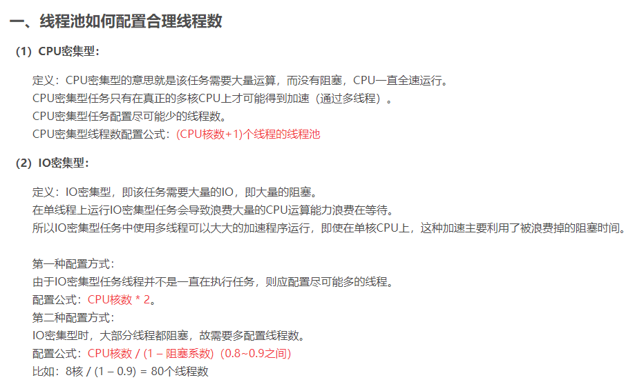
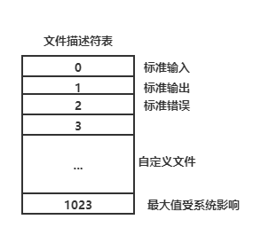

#  GCC

#### gcc编译流程：

1. 创建hello.c源文件
2. gcc -E hello.c ：预处理、头文件展开、宏替换，生成hello.i文件
3. gcc -S hello.i ：生成汇编代码，将汇编代码存入hello.s文件
4. gcc -c hello.s ：将汇编代码转换为二进制文件，生成hello.o
5. 系统调用ld，链接需要的资源，生成可执行文件hello.out

**可以直接 gcc  hello.c即可获得可执行文件**


#### gcc编译参数

- -I(大写i)：包含头文件路径
- -O：优化选项，值为1-3，值越大优化程度越高
- -L：包含库路径
- -l(小写L)：指定库名(如果库名为libabc.so或者libabc.a，那么这个参数格式为 -labc )
- -o：可执行文件的文件名
- -c：编译成.o文件
- -g：添加gdb调试功能
- -Wall：显示更多的警告
- -D：指定宏编译
- -lstdc++：编译c++代码


# 动态库和静态库

虚拟内存：


### 静态库

静态库一般是以.a结尾的文件，文件名格式为lib---.a

编译过程中，编译器会将静态库的内容直接放入程序的代码块（text）中

#### 制作步骤

1. 将.c文件编译为.o文件

2. 将.o文件打包    

   ```shell
   ar rcs libmycalc.a file1.o file2.o
   ```

3. 发布

#### 优缺点

- 优：执行快；发布应用时不需要发布库
- 缺：执行程序的体积相较于动态库会更大；库变更时需要重新编译

#### 静态库的使用

编译时，用 -l 参数添加静态库名

**假设静态库名：libmycalc.a,静态库目录：lib**

```shell
gcc hello.c -o hello -L lib/ -lmycalc
```


### 动态库

动态库一般是以.so结尾的文件，文件名格式为lib---.so

#### 制作步骤

1. 编译与位置无关的代码，生成.o文件，即编译.o文件时加入参数：-fPIC
   
   ```shell
   gcc -fPIC -c hello.c
   ```
   
   
   
2. 将.o文件打包

   ```shell
   gcc -share -o libmycalc.so file1.o file2.0
   ```

3. 发布

#### 优缺点

- 优：程序体积小；库变更时，一般不需要重新编译
- 缺：执行时需要加载动态库，速度会比较慢；发布应用时需要发布动态库

#### 动态库的使用

**假设动态库名：libmycalc.so，动态库目录：lib**

```shell
gcc hello.c -o hello -L lib/ -lmycalc
```


路径配置

1. 将库拷贝到/lib中（不允许）
2. 将库路径添加到环境变量LD_LIBRARY_PATH中（不推荐）
3. 配置/etc/ld.so.conf文件，在里面添加动态库的路径，执行sudo ldconfig -v


# 进程管理

## shell命令

### ps 查看进程相关信息

ps [option]

- a：查看全部进程
- u：用户
- x：与a配合使用
- j：查看进程之间的关系（u和j不能同时使用）


### kill 关闭进程

kill [-SIGN] pid	关闭进程

```shell
kill -l	#查看删除信号SIGN的值
```


## 系统api函数

### fork

pid_t fork(void)	创建一个子进程

实现过程：从当前进程中分配资源，生成一个子进程；如果进程创建失败，fork函数返回-1；创建成功：父进程返回子进程的id、子进程返回0，共有两种返回

解析：pid = fork()	调用fork时，进程分裂，创建子进程；子进程从pid的赋值操作开始运行，而不会再次调用fork，因此子进程中，pid的值为0（getpid获得的值不是这个），而父进程的pid则是子进程调用getpid获得的值

**子进程和父进程有共同资源（如share），但两个进程的share不指向同一块内存，因此其中一个修改share并不会影响另一个进程（即使该资源是指针）。而且子进程与父进程的共享资源的特性是“读时共享写时复制”：子进程的使用共享资源时，如果不修改，则读取父进程的那块内存；如果修改共享资源，系统则会先复制一份给子进程，子进程再修改**

```c
#include <stdio.h>
#include <unistd.h>

int main(){
    int share = 1;
    printf("begin");
	pid_t pid = fork(); //进程在此处开始分裂，子进程从此处开始运行
	if(pid < 0){
		perror("fork error");
		exit(1);
	}
	
	if(pid == 0){//子进程
		printf("child process:pid = %d,ppid = %d\n",getpid(),getppid());
	}
    else if(pid > 0){//父进程
        printf("parent process:pid = %d,ppid = %d\n",getpid(),getppid());
    }
    
    printf("end");
    return 0;
}
```

上述代码中，fork调用前的代码块，仅会执行一次，由主进程执行，因此只会打印一次 "begin"；fork调用后的代码块，主进程与子进程一起执行，因此会打印两次 "end"

执行if-else结构时，主进程会命中else if(pid > 0)，子进程会命中if(pid == 0)，因此两个printf都会被执行

输出结果时，因为主进程是子进程的父进程，所有子进程输出的ppid应该是和主进程输出的pid是一样的，但是结果并不一致；因为如果在主进程执行全部代码，主进程释放之后，子进程才调用getppid，子进程则无法正确地获得主进程的pid；**这种情况下，子进程被称为孤儿进程**

```c
//创建n个进程
int i = 0;
int pid;
while(i<n){  
    pid = fork();
    if(pid > 0){}
    else break;
    i++;
}
```


### getpid

```c
pid_t getpid(void);		//获取当前进程的id
```


### getppid

```c
pid_t getppid(void);	//获取父进程的id
```


### getenv 获取环境变量

```c
char *getenv(const char *name);
```


### kill

```c
int kill(pid_t pid,int sig);	 //进程号为pid的进程发送信号sig
```


### raise

```c
int raise(int sig);	//当前进程发送一个信号
```


### abort

```c
void abort();		//异常退出进程
```


## 进程间通信

### IPC概念

InterProcess Communication (IPC) 进程间通信，通过内核缓冲区进行数据交换的机制

### IPC通信的几种方式

- pipe	管道(只能用于有血缘关系的进程间通信)
- fifo		有名管道
- mmap	文件映射共享IO --速度最快
- 本地socket	--最稳定
- signal	携带信息量最小
- 共享内存


#### pipe

```C
#include <unistd.h>
//默认pipefd[0]是数据读出端,pipefd[1]是数据流入端
int pipe(int pipefd[2]);

//例
int fd[2];	//不需要初始化
pipe(fd);
pid_t pid = fork();
/* ... */
```

#### fifo

```c
#include <sys/types.h>
#include <sys/stat.h>

//创建.fifo,文件
int mkfifo(const char *pathname, mode_t mode);
//通过 open、read 实现通讯 (本质上就是文件IO操作)
```

#### mmap

```c
#include <sys/mman.h>

//成功返回映射区地址,失败MAP_FAIL((void*)-1)
void *mmap(void *addr, size_t length, int prot, int flags,int fd, off_t offset);
/*
	addr 	: 传NULL就行
	length	: 映射区长度
	prot	:	(prot的权限必须不大于fd的本身的权限)
			PROT_READ	可读
			PROT_WRITE	可写
	flags	:
			MAP_SHARED	共享的 : 某一端修改映射区内容,其他客户端都会被修改
			MAP_PRIVATE	私有的 : 不会修改客户端的内容
	fd		: 建立映射区使用的文件描述符
	offset	: 偏移量
*/
//释放映射区
int munmap(void *addr, size_t length);

//匿名映射,用-1给fd传参,系统会自动指定一个文件生成一块映射区
mmap(NULL,length,PROT_READ|PROT_WRITE,MAP_SHARED,-1,0);
```


# exec

使用exec函数后，当前进程将会执行exec参数中给定的指令，代价是失去对该进程的控制。因为exec会将代码块替换成参数中给定指令的实现代码块，因此位于exec函数之后的代码块将不会执行，而且exec除非执行指令时出错，否则exec将不会返回

```c
int execl(const char *path,const char *arg,...);//执行path路径下的arg操作
/*
    例：execl("ls","ls","-lrt",NULL)
    执行ls目录下的ls操作，参数为-lrt，以NULL表示可变参数表以到末尾
*/
```


## execlp与execl类似 具体查看man exec


# 信号处理

### alarm	时钟信号

```c
unsigned int alarm(unsigned int seconds);//定时seconds后发送SIGALRM（该信号的默认操作为终止进程）
```

如果seconds为0，则不发送SIGALRM

- 返回值
  - 剩余秒数：如果存在一个alarm(s1)被调用，在s2秒后（s2 < s1)再次调用调用一个alarm，则返回(s1 - s2) 
  - 0：其他情况


### setitimer	周期性地发送信号

```c
#include <sys/time.h>

//which取值：
//ITIMER_REAL 		现实中经过的时间，并发送SIGALRM信号
//ITIMER_VIRTUAL	程序实际运行时间，发送SIGVTALRM信号
//ITIMER_PROF		发送ITIMER_VIRTUAL信号，具体查看man

//获取curr_value，成功返回0，失败-1
int getitimer(int which, struct itimerval *curr_value);
//开始周期发送信号，开始发送的时间以及每次信号的间隔时间由new_value定义
//old_value是传出参数，用于记录原itimerval的内容，也用于恢复
//成功返回0，失败返回-1
int setitimer(int which, const struct itimerval *new_value,struct itimerval *old_value);

//例：itimerval new_value{{3,0},{5,0}}
//setitimer(ITIMER_REAL,new_value,NULL);
//进程将会在5s后开始周期性发送信号，间隔时间为3s
//可用捕捉函数signal捕捉setitimer发送的信号，进行下一步操作

struct itimerval {
    struct timeval it_interval; /* next value 间隔时间 */
    struct timeval it_value;    /* current value 开始时间 */
};
//总时间为tv_sec + tv_usec
struct timeval {
    time_t      tv_sec;         /* seconds */
    suseconds_t tv_usec;        /* microseconds */
};


```


### 信号集处理函数

```c
#include <signal.h>
//清空信号集
int sigemptyset(sigset_t *set);
//填充信号集
int sigfillset(sigset_t *set);
//添加某个信号到信号集（置为1）
int sigaddset(sigset_t *set, int signo);
//从信号集中删除某个信号（置为0）
int sigdelset(sigset_t *set, int signo);
//判断信号是否在信号集set中
//返回1表示在集合中
int sigismember(const sigset_t *set, int signo);

//设置阻塞或者解除阻塞信号集
//若set非空，how的值所代表的意义:
//SIG_BLOCK		将set中的信号集添加到进程的阻塞信号集中
//SIG_UNBLOCK	将set中的信号集所包含的信号，从阻塞信号集中移除
//SIG_SETMASK	直接将set设置为新的阻塞信号集
//注意：9号信号和19信号无法阻塞，因此即使9号位和19号位被置为1，该信号依然能够生效
int sigprocmask(int how,const sigset_t *set,sigset_t *oldset);

//获取未决信号集（0代表成功，-1代表失败）
int sigpending(sigset_t *set);
```

### 信号捕捉

- 防止进程意外终止

```c
#include <signal.h>

//signum	要捕捉的信号
//handler	处理该信号要执行的函数
typedef void(*sighandlder_t)(int);
sigghandler_t signal(int signum,sighandlder_t handler);

//act		传入的动作
//oldact	原动作，用于恢复
int sigaction(int signum, const struct sigaction *act,struct sigaction *oldact);
struct sigaction {
    void     (*sa_handler)(int);//处理函数
    void     (*sa_sigaction)(int, siginfo_t *, void *);//处理函数
    sigset_t   sa_mask;//执行捕捉函数期间，临时的阻塞信号集
    int        sa_flags;//一般填0，如果填SA_SIGINFO会使用第二个函数指针详细清况查看man
    void     (*sa_restorer)(void);//无效
};
```

- 信号捕捉特性
  1. 进程正常运行时，默认PCB中有一个信号屏蔽字（阻塞信号集），假定为A，他决定了进程自动屏蔽哪些信号。当注册了某个信号的捕捉函数，捕捉到该信号时，要调用该函数。而该函数有可能执行很长事件，在这期间所屏蔽的信号不由A来指定，而是用sigaction中的sa_mask来指定屏蔽哪些信号。调用完信号处理函数，再恢复为A
  2. XXX信号捕捉函数执行期间，XXX信号自动被屏蔽
  3. 阻塞的常规信号不支持排队，产生多次只记录一次


### SIGCHLD 	子进程暂停或终止时发送的信号

- 可以通过SIGCHLD回收子进程


# 会话

#### 创建会话的注意事项

- 调用进程不能是进程组组长
- 调用进程变成新会话的首进程
- 调用进程成为一个新进程组的组长进程
- 新会话丢弃原有的控制终端，该会话没有控制终端
- 建立新会话时，先调用fork，父进程终止，子进程调用setsid

#### getsid、setsid

```c
#include <unistd.h>

//成功，返回调用进程的会话（session）ID；失败返回-1，设置errno
//pid为0表示查看当前进程的会话ID
pid_t getsid(pid_t pid);

//创建新会话
//成功，返回新会话（session）ID；失败，返回-1，设置errno
pid_t setsid(void);

```


# 守护进程

​		Daemon（精灵）进程，是Linux中的后台服务进程，通常独立于控制终端并且周期性地执行某种任务或等待处理某些发生的事件。**一般采用以d结尾的名字**。

​		Linux后台的一些系统服务进程，没有控制终端，不能直接和用户交互。不受用户登录、注销的影响，一直在运行着，**这些都是守护进程**。

#### 创建流程

1. 创建子进程，父进程退出。所有工作在子进程中进行形式上脱离了控制终端
2. 在子进程中创建新会话（调用setsid），使子进程完全独立出来，脱离终端控制
3. 调用chdir函数改变当前目录为根目录（或者其他路径）；因为该进程在当前目录执行，如果其他进程对该目录进行操作，可能会受到限制，因为该守护进程正在占用该目录
4. 调用umask函数重设文件权限掩码，防止继承的文件创建屏蔽字来拒绝某些权限，增加守护进程灵活性
5. 关闭文件描述符。继承的打开文件不会用到，浪费系统资源，且无法卸载
6. 进行守护进程的核心操作
7. 守护进程退出（一般用kill命令）


#### 扩展 nohup指令

通过nohup指令也可以达到守护进程创建的效果

nohup cmd [ > target] &

- cmd：调用的可执行文件
- [ > target ]：将进程执行的输出文件重定向到target文件中（[]不需要写）
- &：后台运行（固定搭配）

例：nohup ./hello >hello.ouput &

创建一个守护进程，该进程执行./hello，如果./hello有输出，则将输出内容重定向到hello.output中


# 线程

轻量级的进程，有默认PCB。与进程先比，没有独立的地址空间（线程间共享地址空间）


#### Linux内核线程实现原理

1. 轻量级进程，有PCB，创建线程使用的底层函数和创建进程一样，都是clone
2. 从内核里看进程和线程是一样的，都有各自不同的PCB
3. 进程至少有一个线程
4. 线程可看做寄存器和栈的集合
5. 在Linux下，线程是最小执行单位；进程是最小的分配资源单位

ps -Lf pid  查看指定线程的lwp号


#### 线程共享资源

- 文件描述符表
- 每种信号的处理方式
- 当前工作目录
- 用户ID和组ID
- 内存地址空间（.text/.data/.bss/heap/共享库）

#### 线程非共享资源

- 线程id
- 处理器现场和栈指针（内核栈）
- 独立的栈空间（用户空间栈）
- errno变量
- 信号屏蔽字（阻塞信号集）
- 调度优先级


#### 线程的优缺点

优点：

- 提高并发性
- 占用资源小
- 通信方便

缺点：

- 库函数，不稳定
- 调试、编写困难
- 对信号支持不好

#### 查看线程库版本

getconf GNU_LIBPTHREAD_VERSION

**版本不同，库函数可能会有差异，导致编译出问题**

#### 线程数量问题

$$
CPU(核数) * 2 + 2,一般情况下
$$

$$
CPU(核数) * 2，该进程用于执行科学计算
$$




## 线程编程

**注：用gcc编译.c时，如果文件中包含线程操作，需要添加 -pthread 参数 (实际添加 -lpthread 表示动态链接pthread共享库)**

```c
#include <pthread.h>

typedef long unsigned pthread_t;

//创建一个线程
//thread：新线程的id，传出参数
//attr：代表线程的属性
//start_routine：线程执行的操作，传入的是(void*) (f)(void*)类型的函数参数
//arg：线程操作函数的参数
int pthread_create(pthread_t *thread, const pthread_attr_t *attr,void *(*start_routine) (void *), void *arg);
//线程属性
typedef struct{
    int detachstate;//线程的分离状态
    int schedpolicy;//线程的调度策略
    struct sched_param schedparam;//线程的调度参数
    int inheritsched;//线程的继承性
    int scope;//线程的作用域
    size_t guardsize;//线程栈末尾的警戒缓冲区大小
    int stackaddr_set;//线程的栈设置
    void* stackaddr;//线程栈的位置
    size_t stacksize;//线程栈的大小
}pthread_attr_t;
int pthread_attr_init(pthread_attr_t *attr);//初始化线程属性
int pthread_attr_destroy(pthread_attr_t *attr);//销毁线程属性
//设置分离属性
/*
detachstate:
	PTHREAD_CREATE_DETACHED 设置线程分离
	PTHREAD_CREATE_JOINABLE 允许回收(默认状态)
*/
int pthread_attr_setdetachstate(pthread_attr_t *attr,int detachstate);

//获取线程id
pthread_t pthread_self(void);

//退出线程
//主控进程如果调用return，归属于主控进程的所有线程都会直接终止
//在进程中使用，进程将会等待线程执行完毕，在执行pthread_exit后面的代码
//在线程中使用，作用类似于return
//retval：线程的返回信息
void pthread_exit(void* retval);

//线程回收
//该函数也会等待线程执行完毕，在继续执行后面的代码
//thread：指定回收线程的id
//retval：传出线程的退出信息
//成功返回0；失败返回-1，设置errno
int pthread_join(pthread_t thread, void **retval);

//杀死线程
//成功返回0；失败返回-1，设置errno
//id为pid的线程被终止后，用pthread_join接受pid的返回信息，可以得到PTHREAD_CANCELED(该值为-1)
int pthread_cancel(pthread_t tid);
//特殊样例：
void* fun(void *arg){ while(1){}; return NULL;}
/* 
	在该程序中，存在一个死循环，而且死循环中不包含取消点。这种情况下，主控进程无法用pthread_cancel终
	止以fun函数为核心操作的线程。（具体有哪些取消点，可以查看man 7 pthreads中的Cancellation Points）
*/
int main(){
    pthread_t tid;
    pthread_create(&tid,NULL,fun,NULL); 
    pthread_cancel(tid);	//无法删除，程序将阻塞在这一步
    return 0；
}
//强行设置取消点
void pthread_testcancel(void);

//线程分离:分离出来的线程不需要pthread_join回收资源，由系统自动回收,此时如果使用pthread_join回收该线程，会出错
//分离后，全局变量依然是共享的
int pthread_detach(pthread_t tid);
//也可以通过pthread_attr_t设置线程信息，使在调用pthread_create时，就将线程分离

//一些工具函数
/*
	进程id在系统是唯一的
	线程id在进程中是唯一的，但是在系统中不一定是唯一的
*/

//比较两个线程的id是否相等
int pthread_equal(pthread_t t1,pthread_t t2);
```


## 线程同步

概念：协同步调，按预定的先后次序运行

#### 为什么要线程同步？

线程的特性：

- 资源共享
- 调度随机

由于线程的特性，如果多个线程同时运行，那么如果同时对同一块内存进行修改，会导致数据混乱


#### mutex 互斥量

```c
//初始化互斥量(锁)
//restrict：约束该内存块区域对应的数据，只能通过restrict修饰的变量进行访问和修改
//mutex：互斥量(锁)
//attr：互斥量的属性，可以忽略，一般填NULL
int pthread_mutex_init(pthread_mutex_t *restrict mutex,const pthread_mutexattr_t *restrict attr);
//也可以用下面代码代替
pthread_mutex_t mutex = PTHREAD_MUTEX_INITIALIZER;

//销毁锁
int pthread_mutex_destroy(pthread_mutex_t *restrict mutex);

//锁的相关操作
int pthread_mutex_lock(pthread_mutex_t *restrict mutex);//加锁
//如果未加锁，调用成功，给共享资源加锁，返回0;否则阻塞等待，直到占用共享资源的线程调用pthread_mutex_unlock为止
int pthread_mutex_trylock(pthread_mutex_t *restrict mutex);//尝试加锁
//一般在调用pthread_mutex_lock前，先调用该函数；如果该函数返回0，则代表共享资源现在未被加锁;如果共享资源已被加锁，则返回errno
int pthread_mutex_unlock(pthread_mutex_t *restrict mutex);//解锁
```

#### 读写锁

一般使用于读操作比较多的进程

特点：

- 读共享，写独占；写优先级高
- 读写锁也是一把锁，但有不同状态
  - 未加锁
  - 读锁
  - 写锁

一般情况：

- 线程a写锁成功，线程b请求读锁：线程b阻塞，直到线程a解锁
- a读锁，b请求写锁：b阻塞，等a解锁
- a读锁，b请求读锁：b加锁成功
- a读锁，b请求写锁，然后c请求读锁：b、c阻塞；b等a解锁；等到b加锁后解锁，c才能加锁
- a写锁，b请求读锁，然后c请求写锁：b、c阻塞；**a解锁后，c加锁（写锁优先级高）;c解锁后，b再加锁**

```c
#include <pthread.h>

int pthread_rwlock_destroy(pthread_rwlock_t *rwlock);
int pthread_rwlock_init(pthread_rwlock_t *restrict rwlock,const pthread_rwlockattr_t *restrict attr);
//宏初始化
pthread_rwlock_t rwlock = PTHREAD_RWLOCK_INITIALIZER;
//读锁
int pthread_rwlock_rdlock(pthread_rwlock_t *rwlock);
int pthread_rwlock_tryrdlock(pthread_rwlock_t *rwlock);
//写锁
int pthread_rwlock_trywrlock(pthread_rwlock_t *rwlock);
int pthread_rwlock_wrlock(pthread_rwlock_t *rwlock);
//解锁
int pthread_rwlock_unlock(pthread_rwlock_t *rwlock);
```


## 死锁

产生原因：

- 交叉锁：线程a调用lock占用了一个共享资源s1，在调用unlock解锁之前，线程a需要使用另一个共享资源s2；而s2又被线程b调用lock占用了，在b解锁s2之前，b需要使用共享资源s1

- 程序调用lock后，在unlock之前又调用了一个lock

交叉锁解决方法：

- 线程按顺序对共享资源进行加锁
- 使用trylock判断，如果存在资源已被占用，释放线程已占用的资源


## 条件变量

可以引起阻塞，并非锁；用于避免无必要的资源竞争

假设有一存放数据共享资源，以及a、b、c...多个线程。

- 锁：运行过程中，a用lock获得了共享资源的使用权，但是共享资源中没有内容可以提供给a，那么a将直接释放共享资源的使用权，重新与多个线程竞争该资源
- 锁+条件变量：运行过程中，a获得共享资源使用权，但共享资源中无内容。此时a不释放该资源，而是进行等待。等到其他线程往该共享资源写入内容时，发出提示。a线程收到提示，停止等待，取出内容后释放该资源

 

#### 实现原理

（消费者）线程如果调用pthread_cond_wait，那么该线程将会进入挂起状态（挂起队列），该线程占用的资源将会暂时释放。

（生产者）线程调用pthread_cond_signal，函数将会从挂机队列中，取出最先入列的（消费者）线程放入到就绪队列（一般是第一位），然后执行该（消费）线程

pthread_cond_broadcast会取出所有（消费者）线程，不过是依次取出，每次取出挂起队列中最先入列的

```c
#include <pthread.h>

int pthread_cond_destroy(pthread_cond_t *cond);//销毁条件变量
int pthread_cond_init(pthread_cond_t *restrict cond,const pthread_condattr_t *restrict attr);//初始化条件变量
//宏初始化
pthread_cond_t cond = PTHREAD_COND_INITIALIZER;

//发出提示：取出挂起队列中的线程
int pthread_cond_broadcast(pthread_cond_t *cond);
int pthread_cond_signal(pthread_cond_t *cond);

//等待提示：调用该函数的线程进入挂起状态，等待其他线程发出提示
int pthread_cond_timedwait(pthread_cond_t *restrict cond,pthread_mutex_t *restrict mutex,const struct timespec *restrict abstime);
int pthread_cond_wait(pthread_cond_t *restrict cond,pthread_mutex_t *restrict mutex);
```

#### 生产者消费者模型

```C
#include <stdio.h>
#include <unistd.h>
#include <pthread.h>
#include <stdlib.h>

typedef struct _mylist{
    int val;
    struct _mylist *next;
}mylist;
//宏初始化条件变量、互斥量
pthread_mutex_t mutex = PTHREAD_MUTEX_INITIALIZER;
pthread_cond_t cond = PTHREAD_COND_INITIALIZER;
//共享内容
mylist *head = NULL;
void* product(void *arg){//生产者
    int myval = 0;
    while(1){
        mylist *temp = (mylist*)malloc(sizeof(mylist));
        temp->val = ++myval;
        pthread_mutex_lock(&mutex);//加锁
        temp->next = head;
        head = temp;
        pthread_mutex_unlock(&mutex);//解锁
        pthread_cond_signal(&cond);//共享资源中有内容，发出提示，让消费者提取 
        sleep(3);
    }
    return NULL;
}
void* customer(void *arg){//消费者
    mylist *temp = NULL;
    while(1){
        pthread_mutex_lock(&mutex);//获取共享资源的控制权
        while(head == NULL){//如果共享资源中没有内容
            pthread_cond_wait(&cond,&mutex);//等待提示
        }
        temp = head;//提取
        head = head->next;
        pthread_mutex_unlock(&mutex);//释放资源控制权
        printf("tid:%lu\tval:%d\n",pthread_self(),temp->val);//输出内容
        sleep(1);
        free(temp);
    }
    return NULL;
}
int main(void){
    pthread_t tid[3];
    pthread_create(&tid[0],NULL,product,NULL);//生产者线程
    pthread_create(&tid[1],NULL,customer,NULL);//消费者线程
    pthread_create(&tid[2],NULL,customer,NULL);
    
    //线程回收
    pthread_join(tid[0],NULL);
    pthread_join(tid[1],NULL);
    pthread_join(tid[2],NULL);
    //销毁资源
    pthread_mutex_destroy(&mutex);
    pthread_cond_destroy(&cond);
    return 0;
}
```


# 信号量

可以理解为加强版的mutex

- mutex调用init：理解为mutex = 1
- mutex调用lock：理解为mutex--
- mutex调用unlock：理解为mutex++

**大意：mutex = 0时，阻塞**

信号量则是初始值不一定是1

```c
#include <semaphore.h>
//编译时需要加上  -pthread

//初始化信号量
//pshared：0代表该信号量在线程中使用；1代表该信号量在进程中使用
//value：允许的并发数（类似于与mutex的初始值）
int sem_init(sem_t *sem, int pshared,unsigned int value);
int sem_destroy(sem_t *sem);

//申请信号量（类似于mutex调用lock）；如果当前value为0，则阻塞
int sem_wait(sem_t *sem);
//释放信号量（unlock）
//如果调用init时，value的值等于0，依然可以调用该函数，将value变为1；即value的值无上限
int sem_post(sem_t *sem);
```

#### 信号量版生产者消费者模型

```c
#include <semaphore.h>
#include <stdio.h>
#include <unistd.h>
#include <pthread.h>
#include <stdlib.h>

const int N = 3;

typedef struct _mylist{
    int val;
    struct _mylist *next;
}mylist;
//初始化信号量
sem_t proc;//生产者信号
sem_t cust;//消费者信号
sem_init(&proc,0,N);
sem_init(&cust,0,0);

//共享内容
mylist *head = NULL;
void* product(void *arg){//生产者
    int myval = 0;
    while(1){
        mylist *temp = (mylist*)malloc(sizeof(mylist));
        temp->val = ++myval;
        sem_wait(&proc);//获取信号量
        temp->next = head;
        head = temp;
        sem_post(&cust);//释放信号量
        sleep(1);
    }
    return NULL;
}
void* customer(void *arg){//消费者
    mylist *temp = NULL;
    while(1){
        sem_wait(&cust);//获取信号量
        temp = head;//提取
        head = head->next;
        sem_post(&proc);//释放信号量
        printf("tid:%lu\tval:%d\n",pthread_self(),temp->val);//输出内容
        sleep(2);
        free(temp);
    }
    return NULL;
}
int main(void){
    pthread_t tid[6];
    pthread_create(&tid[0],NULL,product,NULL);//生产者线程
    pthread_create(&tid[1],NULL,customer,NULL);//消费者线程
    pthread_create(&tid[2],NULL,customer,NULL);
    pthread_create(&tid[3],NULL,customer,NULL);
    pthread_create(&tid[4],NULL,customer,NULL);
    pthread_create(&tid[5],NULL,customer,NULL);
    
    //线程回收
    pthread_join(tid[0],NULL);
    pthread_join(tid[1],NULL);
    pthread_join(tid[2],NULL);
    pthread_join(tid[3],NULL);
    pthread_join(tid[4],NULL);
    pthread_join(tid[5],NULL);
    //销毁资源
    sem_destroy(&sem);
    return 0;
}
```


# 文件锁

借助fcntl函数实现锁机制。操作文件的进程没有获得锁时，可以打开，但无法执行read、write操作

```c
#include <unistd.h>
#include <fcntl.h>

int fcntl(int fd, int cmd, ... /* arg */ );
//fd：文件描述符
//cmd：
//F_SETLK (struct flock *)	设置文件锁
//F_SETLKW (struct flock *)	设置文件锁
//F_GETLK (struct flock *)	获取文件锁
struct flock{
 	short l_type;//锁的类型:F_RDLCK读锁;F_WRLCK写锁;F_UNLCK解锁
    short l_whence;//偏移位置:SEEK_SET、SEEK_CUR、SEEK_END
    short l_start;//起始偏移
    short l_len;//偏移长度；若填0，表示整个文件
    pid_t l-pid;//持有该锁的进程ID
};
```


# makefile

**命名规则：makefile、Makefile**

makefile三要素：

- 目标（必要）
- 依赖
- 规则

```shell
#样例
target:rely
(tab)rule

#根据依赖文件生成对应的可执行文件
hello:hello.c
	gcc hello.c -o hello
	
#使用变量
arg=hello1.c hello2.c
hello:$(arg)
	gcc -o hello $(arg)
	
#使用函数
#wildcard : 文件匹配
#patsubst : 内容替换
arg1=$(wildcard *.c)
#arg1表示所有.c文件
arg2=$(patsubst %.c,%.o,$(arg1))
#arg2将arg1中所有的.c文件变为.o文件 

#使用通配符%
%.c:%.o
	gcc -o $@ $^
#对应的转义字符
#	$@ : 代表目标
#	$^ : 代表全部依赖
#	$< : 第一个依赖
#	$? : 第一个变化的依赖

# -、@的意义
target:rely
	-rule1
	@rule2
#即使rule1报错，仍然执行rule2;执行rule2时，不显示指令内容

#定义伪目标，表明该目标不生成文件，防止歧义
.PHONY:target
#例如用于清理的目标，只执行删除操作，不生成文件;但其他地方一般都有clear，为了防止调用歧义，添加伪目标
clear:%.o
	@rm -f $^
.PHONY:clear

#默认输出第一个目标
make
#输出指定的目标
make target_
```


# gdb

用于程序进行debug调试的工具，在.c文件编译时添加 -g 参数，即可使用

```shell
#操作指令
gdb programme	#开始调试
set args		#设置启动参数
r(un)			#启动,执行到下一个断点
start			#启动,执行main函数,分步调试
n(ext)			#下一条指令
s(tep)			#下一条指令;如果是函数,则会进入函数内部(库函数不行)
q(uit)			#结束

b(reak)			#设置断点;后边可输入行号、函数名、文件名:行号
i(info) b		#查看断点信息,里面包含断点编号
d(el)			#删除断点,后面加info b得到的编号
c(ontinue)		#跳到下一断点
b line if val == n #条件断点;如果val==n,则第line行设置断点

l(ist)			#查看main对应文件的代码,默认显示10行;后面可加 文件名:行号 以显示其他文件的代码
p(rint)			#打印变量的值
p(type)			#打印变量的类型
set	val = n		#设置变量的值
display			#显示变量的值
i(nfo) display	#显示追踪变量的编号
undisplay 		#取消追踪变量,后面加info display得到的编号

```


# 系统IO函数



### open

```c
#include <sys/types.h>
#include <sys/stat.h>
#include <fcntl.h>

//成功返回文件描述符fd,失败返回-1,设置errno
int open(const char* pathname,int flags);
int open(const char* pathname,int flags,mode_t mode);
/*
	pathname : 文件名
	flags : 必选项
		O_RDONLY 	只读
		O_WRONLY 	只写
		O_RDWR		读写
			可选项
		O_APPEND	追加
		O_CREAT		如果文件不存在,会创建
		O_NONBLOCK	非阻塞
	mode : 权限位,输入rwx的8进制数,如0664;其最终的权限是mode & ~unmask
*/
```

### read

```c
#include <unistd.h>

//成功返回读出字符数,0表示到文件末尾,失败返回-1,设置errno
ssize_t read(int fd,void* buf,size_t count);
```

### write

```c
#include <unistd.h>

//成功返回写入字符数,0表示未写入,失败返回-1,设置errno
ssize_t write(int fd,const void* buf,size_t count);
```

### close

```c
#include <unistd.h>

//成功返回0,失败返回-1,设置errno
int close(int fd);
```

### lseek

```c
#include <sys/types.h>
#include <unistd.h>

//成功返回当前位置到开始的长度,失败-1,设置errno
off_t lseek(int fd,off_t offset,int whence);	//设置起始偏移量
/*
	fd : 文件描述符
	offset : 偏移量
	whence : 起始位置
		SEEK_SET	文件开头
		SEEK_CUR	当前位置
		SEEK_END	文件末尾
*/
//查看文件长度
int length = lseek(fd,0,SEEK_END);

//lseek扩展文件大小
lseek(fd,1024,SEEK_END);	//文件扩展多1024字符
write(fd,buf,sizeof(buf));	//必须写一次才能生效
```


# fcntl

设置文件属性

```c
#include <unistd.h>
#include <fcntl.h>

int fcntl(int fd,int cmd, ... /* arg*/ );
//cmd : F_GETFL	获取属性	F_SETFL	设置属性
//例 : 给文件添加非阻塞属性
int flag = fcntl(fd,F_GETFL);	//获取当前文件属性
flag |= O_NONBLOCK;//添加非阻塞属性
fcntl(fd,F_SETFL,flag);	//设置属性
```


# stat

```c
#include <sys/types.h>
#include <sys/stat.h>
#include <unistd.h>

//获取文件信息;如果文件目录中有软连接,stat直接显示软连接指向的文件,lstat只会显示软连接文件
int stat(const char *pathname, struct stat *buf);
int fstat(int fd, struct stat *buf);
int lstat(const char *pathname, struct stat *buf);

#include <fcntl.h>           /* Definition of AT_* constants */
#include <sys/stat.h>

int fstatat(int dirfd, const char *pathname, struct stat *buf,int flags);

struct stat {
    dev_t     st_dev;         /* ID of device containing file */
    ino_t     st_ino;         /* inode number */
    mode_t    st_mode;        /* file type and mode */
    nlink_t   st_nlink;       /* number of hard links */
    uid_t     st_uid;         /* user ID of owner */
    gid_t     st_gid;         /* group ID of owner */
    dev_t     st_rdev;        /* device ID (if special file) */
    off_t     st_size;        /* total size, in bytes */
    blksize_t st_blksize;     /* blocksize for filesystem I/O */
    blkcnt_t  st_blocks;      /* number of 512B blocks allocated */

    /* Since Linux 2.6, the kernel supports nanosecond
                  precision for the following timestamp fields.
                  For the details before Linux 2.6, see NOTES. */

    struct timespec st_atim;  /* time of last access */
    struct timespec st_mtim;  /* time of last modification */
    struct timespec st_ctim;  /* time of last status change */

    #define st_atime st_atim.tv_sec      /* Backward compatibility */
    #define st_mtime st_mtim.tv_sec
    #define st_ctime st_ctim.tv_sec
};

```

# access

```c
#include <unistd.h>

//判断文件权限;成功0,失败-1返回errno
int access(const char *pathname, int mode);
/* mode :
	R_OK	是否有读权限
	W_OK	是否有写权限
	X_OK	是否有可执行权限
	F_OK	是否存在
*/
```

# truncate

```c
#include <unistd.h>
#include <sys/types.h>

//截取文件;成功0,失败-1设置errno
int truncate(const char *path, off_t length);
int ftruncate(int fd, off_t length);
```

# link

```c
#include <unistd.h> 

//创建硬连接;成功0,失败-1设置errno
int link(const char *oldpath, const char *newpath);
//创建软连接
int symlink(const char *oldpath, const char *newpath);
//删除连接;如果该文件被占用,则会等待该文件被释放后才删除
int unlink(const char *pathname);

```

# rename

```c
#include <stdio.h>

//重命名
int rename(const char *oldpath, const char *newpath);
```

# dir

```c
#include <unistd.h>
//获得当前路径
char *getcwd(char *buf, size_t size);
char *getwd(char *buf);
char *get_current_dir_name(void);

#include <unistd.h>
//修改程序执行路径
int chdir(const char *path);
int fchdir(int fd);

#include <sys/stat.h>
#include <sys/types.h>
//创建目录
int mkdir(const char *pathname, mode_t mode);

#include <unistd.h>
//删除目录
int rmdir(const char *pathname);

#include <sys/types.h>
#include <dirent.h>
//打开目录
DIR *opendir(const char *name);
DIR *fdopendir(int fd);

/* ...... */
```

# dup

```c
#include <unistd.h>
//重定向
int dup(int oldfd);
//如果newfd已经打开，则先将其关闭。
//如果newfd等于oldfd，则dup2返回newfd, 而不关闭它。
//dup2函数返回的新文件描述符同样与参数oldfd共享同一文件表项
int dup2(int oldfd, int newfd);
```

