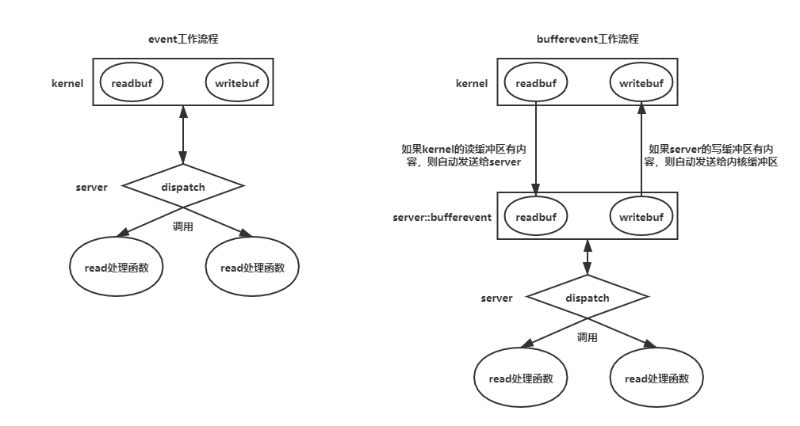
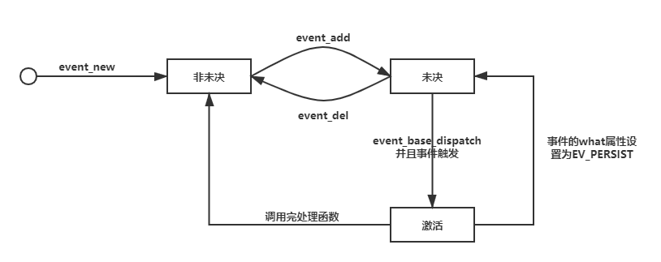

# Socket

socket: 在TCP/IP协议中,“IP地址+TCP或UDP端口号”唯 一标识 网络通讯中的 一个进程,所以“IP地址+端口号”就称为socket。 在TCP协议中,建立连接的两个进程各自有 一个socket来标识,那么这两个socket组成 的socket pair就唯一标识一个连接。 TCP/IP协议最早在BSD UNIX上实现,为TCP/IP协议设计的应用层编程接口称为socket  API。


## 大端存储、小端存储

连续地址段：0x00,0x01,0x02,0x03

数据段：12345678

类似这样的连续地址段中，0x00被称为 **低地址段**，0x03被称为 **高地址段**；数据段中，1代表 **高位**，8代表 **底位**；如果存在符号，那么符号会是最高位

因为每段地址中能存两位，因此数据段将会被分为4段

大端存储（低地址存高位）：0x00(12),0x01(34),0x02(56),0x03(78)
小端存储（低地址存低位）：0x00(78),0x01(56),0x02(34),0x03(12)


### hton、ntoh

由于TCP/IP协议规定，网络数据流应采用大端字节序（低地址存高位）。因此在socket通信时，需要对IP和端口的格式转为大端字节序

- h：主机端的数据段
- n：网络端的数据段
- s：代表转换的字节序是16位的端口
- l：代表转换的字节序是32位的IP

**函数意义：h to n s（主机的端口字节序，转换位网络端的端口字节序）**

```c
#include <arpa/inet.h>

uint32_t htonl(uint32_t hostlong);
uint16_t htons(uint16_t hostshort);
uint32_t ntohl(uint32_t netlong);
uint16_t ntohs(uint16_t netshort);
```

**如果主机端的字节序是大端存储的，那么函数将不执行任何操作，否则返回大端字节序**


### aton、ntoa地址格式转换

通常用户在表达地址时采用的是 **点分十进制** 表示的数值（或者是用冒号分开的十进制IPv6地址），例如：127.0.0.1;而在通常使用的Socket编程中使用的则是32位的网络字节序的二进制值，因此需要进行转换

- a：网络地址字符串，例："127.0.0.1"
- n：网络字节序的二进制值

```c
#include <sys/socket.h>
#include <netinet/in.h>
#include <arpa/inet.h>

//将cp指向的网络地址字符串，转换成网络字节序的二进制值，存放到结构体inp所指的in_addr中
int inet_aton(const char *cp, struct in_addr *inp);
struct in_addr{ unsigned long int s_addr; };

char *inet_ntoa(struct in_addr in);
//将结构体in中的s_addr的网络字节序二进制值，转换成网络地址字符串

unsigned long int inet_addr(const char *cp);
//将网络地址字符串转换为网络字节序二进制值

int inet_pton(int af, const char *src, void *dst);
/*
	将src转换成网络字节序二进制值，存放到dst中
	af : 协议族
	src : 字符串地址：127.0.0.1
	dst : 存放位置，一般是sockaddr类型
	例 : inet_pton(AF_INET,"127.1",&dst.sin_addr.s_addr);
*/
const char *inet_ntop(int af, const void *src,char *dst, socklen_t size);
/*
	将src转换成网络地址字符串返回
	af : 协议族
	src : 网络字节序二进制值，一般为unsigned long int*
	dst : 如果调用成功，这个指针将作为返回值，指向一个点分十进制的地址字符串
	size : dst的长度，防止读取溢出
*/
```


## bind 绑定IP和端口

- **套接字初始化后，会默认绑定主机地址和一个随机的端口**。要想让别的主机能够准确连接，就需要自己指定一个端口
- 由于服务器程序所监听的网络地址和端口号通常是固定不变的，因此服务器调用bind绑定一个固定的网络地址和端口号后，客户端就能准确连接 

```c
int bind(int sockfd, struct sockaddr *my_addr,socklen_t addrlen);
/*
	sockfd			调用socket获得的返回值
	my_addr：本地套接字信息
		一般初始化流程:
		struct sockaddr_in my_addr;
		memset(&my_addr,0,sizeof(struct sockaddr));
		my_addr.sin_family = AF_INET;//IPv4
		my_addr.sin_port = htons(MY_PORT);//端口，端口号为自定义的端口值MY_PORT
		my_addr.sin_addr.s_addr = inet_addr(MY_IP);//IP地址，利用inet_addr函数将MY_IP转换为网络字节序二进制值
	addrlen			套接字信息长度，通常用sizeof(my_addr)
	
	例：bind(sockfd,(struct sockaddr*)&my_addr,sizeof(my_addr));
*/
```


## sockaddr 套接字IP、端口信息

sockadrr 和 sockaddr_in 结构体存储着IP、端口等信息。通讯过程中，客户端会初始化一个包含目标主机IP、端口信息的 sockaddr 结构体对象，通过connect或者send、sendto这些操作发送到运输层，**运输层会把自身的IP、端口信息添加到报文中**，发送给网络层、物理层。当目标服务端解析报文时，会将**客户端的IP、端口信息**打包到一个 sockaddr 结构体，作为recv、recvfrom等接受函数的参数进行返回，从而让服务端得知客户端的IP、端口信息；服务端向客户端发送信息也是如此。

```c
//套接字IP、端口信息
struct sockaddr {
	unsigned short sa_family;  /* 地址族, AF_xxx */
	char sa_data[14];  /* 14字节的协议地址*/
};   
struct sockaddr_in {
	short int sin_family; /* 地址族 */
	unsigned short int sin_port; /* 端口号 */
	struct in_addr sin_addr; /* Internet地址 */
	unsigned char sin_zero[8]; /* 与struct sockaddr一样的长度 */
};
struct in_addr {
	unsigned long s_addr; //32位IP地址
};
```


## TCP通信流程

**socket通信的本质，就是文件I/O操作**

| 服务端                                                       | 客户端                                                       |
| ------------------------------------------------------------ | ------------------------------------------------------------ |
| 1.socket：创建套接字<br />2.bind：绑定套接字<br />3.listen：设置套接字为监听模式<br />4.accept：等待接收请求，建立连接<br />5.read(recv)、write(send)：读取、写入数据<br />6.close：关闭连接 | 1.socket：创建套接字<br />2.connnect：发出请求，等待建立连接<br />3.read(recv)、write(send)：读取、写入数据<br />4.close：关闭连接 |

```c
#include <sys/types.h>
#include <sys/socket.h>

int socket(int domain, int type, int protocol);
/*
	domain:  family(协议族)
     AF_INET         	IPv4 
     AF_INET6			IPv6
     AF_LOACL			Unix域协议
     
     type:套接字类型
     SOCK_STREAM		字节流套接字：TCP协议使用的套接字
     SOCK_DGRAM			数据报套接字：UDP协议使用的套接字
     
     protocol:协议类型
     IPPROTO_TCP		TCP协议
     IPPROTO_UDP		UDP协议
     IPPROTO_SCTP		SCTP协议
     
     返回值：返回一个文件描述符，失败返回-1，设置errno
*/

------------------------------------------------------------------------------------------------------------

int listen(int sockfd,int backlog);//设置监听
/*
	sockfd		套接字文件描述符，socket函数的返回值
	backlog		最大的连接数
*/

------------------------------------------------------------------------------------------------------------

int accept(int sockfd,struct sockaddr *addr,socklen_t *addrlen);
/*	
	addr		传出参数，请求连接的客户端调用connect函数中的参数
	函数返回值是客户端传入的文件描述符sockfd，服务端对客户端的数据操作通过sockfd完成
*/
int connect(int sockfd,const struct sockaddr*addr,socklen_t addrlen);//请求连接
/*
	sockfd		socket函数返回值，后续的数据操作通过该值完成
	addr		目标服务器地址信息
*/
```

## UDP通信过程

| 服务端                                                       | 客户端                                                       |
| ------------------------------------------------------------ | ------------------------------------------------------------ |
| 1.socket：创建套接字<br /> 2.bind：绑定套接字 <br />3.recvfrom：获取客户端数据（包括IP和端口） <br />4.sendto：向客户端发送数据 <br />5.close：关闭连接 | 1.socket：创建套接字 <br />2.sendto：向服务端发送数据 <br />3.recvfrom：获取服务端数据 <br />4.close：关闭连接 |

```c
#include <sys/types.h>
#include <sys/socket.h>

//flags 通常使用0

ssize_t recvfrom(int sockfd,	//主机的套接字文件描述符
                 void *buf,		//读取缓冲区
                 size_t len, 
                 int flags,		
                 struct sockaddr *src_addr,	//发送端的IP、端口信息
                 socklen_t *addrlen
          		);

ssize_t sendto(int sockfd, 		//主机文件描述符
               const void *buf, //写入缓冲区
               size_t len, 
               int flags,
               const struct sockaddr *dest_addr, //接收端的IP、端口
               socklen_t addrlen
              );
```


## sockopt 套接字属性

```c
#include <sys/types.h>  
#include <sys/socket.h>

/* ---------------------------------------------------------------------------------------------------------

端口复用。TCP通讯时，如果服务端主动发起断开连接请求，那么3次挥手完成之后，服务端会进入到TIME_WAIT状态，这个状态将持续2MSL(MSL的时长因系统而异)。2MSL之后，服务端的端口才会被释放。如果在释放之前，服务器再启动，将会提示该端口被占用的错误信息

--------------------------------------------------------------------------------------------------------- */

//optval的类型根据level和optname决定，具体百度或者查看Unix网络编程
int getsockopt(int sockfd, int level, int optname,void *optval, socklen_t *optlen);
int setsockopt(int sockfd, int level, int optname,const void *optval, socklen_t optlen);

//端口复用
int flag = 1;
setsockopt(fd,SOL_SOCK,SO_REUSEADDR,&flag,sizeof(flag));
```


## select

实现原理：数组

```c
#include <sys/select.h>
#include <sys/time.h>
#include <sys/types.h>
#include <unistd.h>

int select(int nfds,				//要检测的文件描述符中最大的fd + 1，最大可填1024
          fd_set *readfds,			//读集合
          fd_set *writrefds,		//写集合
          fd_set *exceptfds,		//异常集合
          struct timeval *timeout	//若为NULL，则一直阻塞，直到检测到fd变化为止；不然就阻塞timeout秒
          );
//	fd_set是一个标志位集合，类似于阻塞信号集；如果文件描述符在集合中，则对应的标志位会置为1
//如果标志位为0，则内核会跳过对该标志位对应的文件描述符的检测
//fd_set集合操作
void FD_ZERO(fd_set *set);//全部清空（全部置为0）
void FD_CLR(int fd,fd_set *set);//删除fd对应的那一项（置为0）
void FD_SET(int fd,fd_set *set);//将fd添加到集合（置为1）
int FD_ISSET(int fd,fd_set *set);//判断fd是否在set中

//判断是否有变化
FD_ISSET(fd,&set);
```

## poll

实现原理：线性表

```c
#include <poll.h>

int poll(struct pollfd *fd,nfds_t nfds,int timeout);
/*
	fd:pollfd类型的数组地址
	nfds:fd的中已初始化的最后一个元素的下标+1
	timeout:
		-1 : 永久阻塞
		0 : 调用完立即返回
		>0 : 阻塞timeout毫秒
*/
struct pollfd{
    int fd;
    short events;//等待的事件
    //	POLLIN 读、POLLOUT 写
    short revents;//实际发生的事件
};
//判断是否有变化
fd[index].revents & POLLIN;//如果有写入，则为真
```

## epoll


### 实现原理

客户端与服务端通信通过epoll实现IO转接操作，是依靠内核缓冲区完成的。

数据结构：红黑树

```c
#include <sys/epoll.h>

int epoll_create(int size);//创建一个根节点epfd；size是根节点可以增加的子节点个数，非强制性，如果子节点大于size，自动扩展

/* ------------------------------------------------------------------------------------------------------ */

int epoll_ctl(int epfd, int op, int fd, struct epoll_event *event);
// 	epfd : 根节点
//	op : 操作选项
//	- EPOLL_CTL_ADD	增加节点
//	- EPOLL_CTL_DEL	删除节点
//	- EPOLL_CTL_MOD	修改节点
//	fd : 操作的对象
//	event : fd的详细属性
struct epoll_event{
    //fd发生的事件
  	uint32_t event;//	- EPOLLIN	读 	- EPOLLOUT	写  - EPOLLERR	错误
    epoll_data_t data;//fd的详细属性
};
typedef union{
    void *ptr;//一般是自定义结构体的指针，为了存放更多的内容
    int fd;//(常用项)文件描述符
    uint32_t u32;
    uint64_t u64;
}epoll_data_t;

/*  例 : 把fd添加到epfd中
	struct epoll_event event
	event.event = EPOLLIN;
	event.data.fd = fd;
	epoll_ctl(epfd,EPOLL_CTL_ADD,fd,&event);
*/

/* ------------------------------------------------------------------------------------------------------ */

int epoll_wait(int epfd, struct epoll_event *events,int maxevents, int timeout);
//	epfd : 根节点
//	events : 这是一个结构体数组，存放发生了事件的结构体对象
//	maxevents : 数组的大小
//	timeout : 阻塞时长
//		- -1 : 一直阻塞
//		-  0 : 立即返回
//		-  n : 阻塞n --毫秒-- 后返回
//	返回值 : events中有效长度

/*  例 : 读取数据
	int lfd = socket(AF_INET,SOCK_STREAM,0);	
	bind();		//简略操作
	listen();	//意思意思
	
	int epfd = epoll_create(MAX);
	
	struct epoll_event lfd_event; 	//监听文件描述符的事件信息
	lfd_event.event = EPOLLIN;		//如果有写入，就能触发该事件
	lfd_event.data.fd = lfd;
	epoll_ctl(epfd,EPOLL_CTL_ADD,fd,&lfd_event);//将监听节点放入epoll树中
	
	struct epoll_event events[MAXLEN]; 	//存放事件的数组
	int ret = epoll_wait(epfd,events,MAXLEN,-1);	//如果没有检测到写入操作，则会一直阻塞
	for(int i = 0;i < ret;++i){
		if(events[i].fd == lfd){ accept(); }//监听节点有写入，代表有新连接
		else{ int cfd = events[i].fd; recv(fd); }//读取数据
	}
	
*/

/* ------------------------------------------------------------------------------------------------------ */
```

### epoll的工作模式

#### 水平触发模式（默认模式）


服务端调用epoll_wait时，如果没有客户端发送数据，服务端将会进入阻塞状态
当有客户端发送数据后，epoll_wait解除阻塞，服务端从内核缓冲区中读取数据。由于recv参数中的buf是有大小限制的，如果buf的长度小于客户端发送的数据，那么服务端第一次只会读取MAX个字符。然后继续运行进程。
由于内核缓冲区中还有数据，所以再调用epoll_wait时，即使没有客户端写入新数据，epoll_wait也会直接解除阻塞，继续读取内核缓冲区的内容，直到内核缓冲区没有数据为止

**缺点：epoll_wait的效率低。每次epoll_wait只读取一次，当数据量大时，epoll_wait将被频繁调用**

#### 边沿触发模式（ET）

.png)

相较于水平触发模式，边沿触发模式只有当客户端写入数据时，服务端才会读取数据。因此上图中，内存缓存区将会剩余50个字符未被读取，直到客户端再次写入数据。

**缺点：会造成内存缓冲区有数据残留**


##### 实现

在将文件挂到epoll树上时，对文件描述符结构体添加EPOLLET

```c
int fd = accept();
struct epoll_event fd_event;
fd_event.event = EPOLLIN | EPOLLET; //当文件写入时，会触发；
fd_event.fd = fd;
epoll_ctl(epfd,EPOLL_CTL_ADD,fd,&fd_event);
```


#### 边沿非阻塞模式（推荐）

由于边沿触发模式只会在客户端写入时才会触发，那么只需要触发时，将所有的内容读取出来即可避免数据残留

##### 实现

```c
int fd = accept();

int flags = fcntl(fd,F_GETFL);	//获取当前文件配置
flags |= O_NONBLOCK;			//read操作时，非阻塞
fcntl(fd,F_SETFL,flags);

struct epoll_event fd_event;
fd_event.event = EPOLLIN | EPOLLET; //设置边沿触发操作
fd_event.fd = fd;
epoll_ctl(epfd,EPOLL_CTL_ADD,fd,&fd_event);

while(epoll_wait()){
    while(read(fd)) ... //将数据全部读出
}
```

- 因为read默认阻塞，如果不用fcntl设置，那么程序将会阻塞在read处，导致程序不正确的运行(无法再次运行到epoll_wait)
- read设置非阻塞后，如果文件读取到末尾，再次调用read将会返回-1。可以通过 **errno == EAGAIN** 判断是否到结尾

### epoll扩展（EPOLLIN、EPOLLOUT）

因为客户端与服务端依靠内核缓冲区进行通信，因此调用epoll_wait时，捕获信息是靠判断内核缓冲区的变化来实现的。

#### EPOLLIN

- 水平触发模式

  epoll根节点上，存在一节点，其对应的客户端往内核缓冲区写入了数据，即内核缓冲区有数据可以提供给该节点读取，那么epoll_wait将被唤醒，只到内核缓冲区中数据被读取完

- 边沿触发模式

  客户端往内核缓冲区写入一次数据，epoll_wait就唤醒一次

#### EPOLLOUT

- 水平触发模式

  如果节点的event被设置为EPOLLOUT，意味着是节点往内核缓冲区写入数据。因此，只要内核缓冲区未满（一般情况下，内核缓冲区不会被写满）,epoll_wait将会一直被唤醒，直到内核缓冲区写满为止，或者event被修改

- 边沿触发模式

  - 第一次epoll_wait会被唤醒
  - 写缓冲区从满到未满的状态转换时，会被唤醒一次

**总结：EPOLLOUT通常用来判断写缓冲区是否写满**


## 本地套接字

| 服务端                                                       | 客户端                                                       |
| ------------------------------------------------------------ | ------------------------------------------------------------ |
| 1.socket：创建套接字 <br />2.bind：绑定套接字 <br />3.listen：设置套接字为监听模式 <br />4.accept：等待接收请求，建立连接 <br />5.read(recv)、write(send)：读取、写入数据 <br />6.close：关闭连接 | 1.socket：创建套接字 <br />2.connnect：发出请求，等待建立连接 <br />3.bind：绑定套接字(**一般TCP客户端不需要这一步**)<br />4.read(recv)、write(send)：读取、写入数据 <br />4.close：关闭连接 |

```c
//本地套接字使用的IP、端口信息结构体
struct sockaddr_un{
    __karnel_sa_family_t sun_family;	//协议族:AF_INET这些
    char sun_path[108];					//本地.socket文件的目录
};
//例
int fd = socket(AF_LOCAL,SOCK_STREAM,0);//本地套接字通信使用的协议为AF_LOCAL或者AF_UNIX

unlink("./local.socket");		//一般会在bind函数前，删除local.socket，防止bind创建失败
struct sockaddr_un unaddr;
unaddr.sun_family = AF_INET;
strcpy(unaddr.sun_path,"./local.socket");	//表示当前文件夹下面的local.socket文件，后缀名是约定俗成的
bind(fd,(sockaddr*)&unaddr);				//如果local.socket不存在，则会在bind这一步创建该文件夹
```

服务端：

```c
int fd = socket();
struct sockaddr_un server;
server.sun_family = AF_INET;
unlink("./server.socket");		//绑定之前删除文件
strcpy(server.sun_path,"./server.socket");
bind();
listen();
accept();
close();
```

客户端：

```c
int fd = socket();
struct sockaddr_un client;
client.sun_family = AF_INET;
unlink("./server.socket");
strcpy(client.sun_path,"./cilent.socket");
bind();
// --------------------------------------------
struct sockaddr_un server;
server.sun_family = AF_INET;
strcpy(server.sun_path,"./server.socket");
connect(fd,(sockaddr*)&server);
recv();send();//...
close();
```


## 心跳机制

服务器与客户端定时给对方发送一个数据包（心跳包），该数据包只携带相当少的内容。用于检测两端的连接是否存在，若存在，则继续定期检测；否则发起重连。

乒乓包：携带的数量比心跳包多一点，可以用来获取一些信息


## 广播

**适用场景：仅用于局域网**

**IP：---.---.---.255  	255是通配字段，表示该字段中任何值都能与它匹配，因此这样格式的IP地址是广播地址**

**网关地址：---.---.---.1**

| 服务端                                                       | 客户端                                                       |
| ------------------------------------------------------------ | ------------------------------------------------------------ |
| 1.socket：创建套接字  <br />2.setsockopt：设置广播属性 <br />3. sendto：发送数据 <br />4.close：关闭 | 1.socket：创建套接字  <br />2.bind：绑定套接字<br />3.recvfrom：接收数据  <br />4.close：关闭 |

**设置广播权限**

```c
int flag = 1;
setsockopt(fd,SOL_SOCK,SO_BROADCAST,&flag,sizeof(int));
```


## 组播

**适用场景：局域网、Internet**

**原理：服务端通过组播地址和端口，向组播地址中的客户端发送数据**

| 服务端                                                       | 客户端                                                       |
| ------------------------------------------------------------ | ------------------------------------------------------------ |
| 1.socket：创建套接字   <br />2.bind：绑定套接字<br />3.sockaddr：利用组播地址初始化客户端IP、端口信息<br />4.setsockopt：设置组播权限<br />5.sendto：通过组播地址发送数据<br />6.close：关闭 | 1.socket：创建套接字   <br />2.bind：绑定套接字 <br />3.setsockopt：设置组播地址<br />4.recvfrom：接收数据<br />5.关闭 |

```c
struct ip_mreqn{
  	struct in_addr imr_multiaddr;	//组播组的IP
    struct in_addr imr_interface;	//本地IP
    int imr_ifindex;	//网卡编号
};
unsigned int if_nametoindex(char *ifname);//获取网卡编号
struct in_addr{
    typedef unsigned long int in_addr_t;
  	in_addr_t s_addr;  
};
```

设置组播权限（服务端）：

```c
struct ip_mreqn flag;
inet_pton(AF_INET,"239.0.0.10",&flag.imr_multiaddr.s_addr);
inet_pton(AF_INET,"0.0.0.0",&flag.imr_interface.s_addr);
flag.imr_ifindex = if_nametoindex("en33");
setsockopt(fd,IPPROTO_IP,IP_MULTICAST_IF,&flag,sizeof(flag));
```

加入组播地址（客户端）：

```c
struct ip_mreqn flag;
inet_pton(AF_INET,"239.0.0.10",&flag.imr_multiaddr.s_addr);
inet_pton(AF_INET,"0.0.0.0",&flag.imr_interface.s_addr);
flag.imr_ifindex = if_nametoindex("en33");
setsockopt(fd,IPPROTO_IP,IP_ADD_MEMBERSHIP,&flag,sizeof(flag));//第三个参数改变了
```

服务端：

```c
int fd = socket(AF_INET,SOCK_DGRAM,0);//无论广播还是组播，文件格式都是用数据报文格式
struct sockaddr_in server;
memset(&server,0,sizeof(server));
server.sin_family = AF_INET;
server.sin_port(8888);
inet_pton(AF_INET,"0.0.0.0",server.sin_addr.s_addr);
bind(fd,(sockaddr*)&server,sizeof(server));

//根据广播地址初始化客户端IP、端口信息
struct sockaddr_in cilent;
memset(&client,0,sizeof(client));
cilent.sin_family = AF_INET;
cilent.sin_port(8888);
inet_pton(AF_INET,"239.0.0.10",cilent.sin_addr.s_addr);

//设置组播权限
struct ip_mreqn flag;
inet_pton(AF_INET,"239.0.0.10",&flag.imr_multiaddr.s_addr);
inet_pton(AF_INET,"0.0.0.0",&flag.imr_interface.s_addr);
flag.imr_ifindex = if_nametoindex("en33");
setsockopt(fd,IPPROTO_IP,IP_MULTICAST_IF,&flag,sizeof(flag));

//发送数据
sendto();
```

客户端：

```c
int fd = socket(AF_INET,SOCK_DGRAM,0);
struct sockaddr_in cilent;
memset(&client,0,sizeof(client));
cilent.sin_family = AF_INET;
cilent.sin_port(8888);
inet_pton(AF_INET,"0.0.0.0",cilent.sin_addr.s_addr);
bind(fd,(sockaddr*)&client,sizeof(client));

//客户端加入组播地址
struct ip_mreqn flag;
inet_pton(AF_INET,"239.0.0.10",&flag.imr_multiaddr.s_addr);
inet_pton(AF_INET,"0.0.0.0",&flag.imr_interface.s_addr);
flag.imr_ifindex = if_nametoindex("en33");
setsockopt(fd,IPPROTO_IP,IP_ADD_MEMBERSHIP,&flag,sizeof(flag));

//接收数据
recvfrom();
```


#### 组播地址（详细见百度）

- 224.0.0.0～224.0.0.255为预留的组播地址（永久组地址），地址224.0.0.0保留不做分配，其它地址供路由协议使用；

- 224.0.1.0～224.0.1.255是公用组播地址，可以用于Internet；

- 224.0.2.0～238.255.255.255为用户可用的组播地址（临时组地址），全网范围内有效；

- 239.0.0.0～239.255.255.255为本地管理组播地址，仅在特定的本地范围内有效。


# libevent

**定义：libevent封装了select、poll、epoll等IO转接函数，是专门用来实现跨平台网络编程、做高并发的动态库。**

## 操作流程

### 创建事件框架（event_base）

```c
#include <event2/event.h>

struct event_base* event_base_new();

//如果子进程创建在event_base_new之后，则子进程需要重新初始化base才能使用
int event_reinit(struct event_base* base);
```

### 创建事件



- 不带缓冲区的事件(event)

```c
#include <event2/event.h>

#define 	EV_TIMEOUT	0x01	//超时检测（废弃）
#define 	EV_READ		0x02
#define 	EV_WRITE	0x03
#define 	EV_SIGNAL	0x04
#define 	EV_PERSIST	0x05	//持续触发
#define 	EV_ET		0x06	//边沿模式
typedef void(*event_callback_fn)(evutil_sockt_t,short,void*);//回调函数指针
struct event* event_new(	//创建事件
    struct event_base* base;//事件框架
    evutil_sockt_t fd,		//文件描述符
    short what,				//取上面的几个宏
    event_callback_fn cb,	//事件的回调函数
    void* arg;				//传给回调函数的参数
);
```

**使用event_new创建出来的事件处于非未决状态，需要将事件添加到事件框架后，才能转换为未决状态**

- 带缓冲区的事件(bufferevent)

  **默认情况下，bufferevent的写缓冲区是可用的，读缓冲区是关闭的**

```c
#include <event2/bufferevent.h>

struct bufferevent* bufferevent_socket_new(
	struct event_base* base;
    evutil_socket_t fd;		//该事件的缓冲区对应的文件描述符
    enum bufferevent_options options;
    /*
    	BEV_OPT_CLOSE_ON_FREE(常用) : 释放bufferevent时关闭底层传输端口。这将关闭fd，释放底层bufferevent等
    	BEV_OPT_THREADSAFE : 自动为bufferevent分配锁，这样就可以安全地在多个线程中使用bufferevent
    	BEV_OPT_DEFER_CALLBACKS : 设置这个标志时，bufferevent延迟所有回调
    	BEV_OPT_UNLOCK_CALLBACKS : 默认情况下，如果设置bufferevent为线程安全的，则bufferevent会在调用用户提供的回		 						    调时进行锁定。这个选项会让libevent在执行回调的时候不进行锁定
    */
);
```


### 事件管理



**不带缓冲的事件**

```c
#include <event2/event.h>

//将事件添加到事件框架中（设置未决）。成功0，失败-1
int event_add(
    struct event* ev,		//添加的事件
  	const struct timeval* tv//超时检测
    /*
    	tv的取值代表该事件进入到未决状态后，指定之间之内没有触发，则会主动触发一次（调用回调函数），以此代替宏EV_TIMEOUT
    	设置NULL的话，将不检测
    */
);
int event_del(struct event* ev);//从事件框架中删除事件（设置非未决）。成功0，失败-1
```

**带缓冲的事件**

```c
#include <event2/bufferevent.h>

//客户端连接服务端使用的函数
int bufferevent_socket_connect(
	struct bufferevent* bev,
    struct sockaddr* address,	//服务端的IP、端口信息
    int addrlen
);

//读写缓冲区回调操作
typedef void(*bufferevent_data_cb)(
	struct bufferevent* bev,
    void* ctx	//传入参数，由bufferevent_setcb设置
);
typedef void(*bufferevent_event_cb)(
	struct bufferevent* bev,
    short events,
    void* ctx	//传入参数，由bufferevent_setcb设置
);
/*events: 
	EV_EVENT_READING : 读取操作时发生某事件
	BEV_EVENT_WRITING : 写入操作时发生某事件
	BEV_EVENT_ERROR : 操作时发生错误
	BEV_EVENT_TIMEOUT : 发生超时
	BEV_EVENT_EOF : 遇到文件结束提示
	BEV_EVENT_CONNECTED : 请求的连接过程已经完成
*/

//设置事件的回调函数
void bufferevent_setcb(
	struct bufferevent* bufev,
    bufferevent_data_cb readcb,		//读事件回调，配合bufferevent_read使用
    bufferevent_data_cb writecb,	//写事件回调
    bufferevent_event_cb eventcb,
    void* cbarg		//传给回调函数的参数
);
//从事件读缓冲区读取内容
size_t bufferevent_read(
	struct bufferevent* bufev,
    void* data,	//用来存放读出数据的缓冲区
    size_t size	//缓冲区大小
);
//先事件写缓冲区写入内容
size_t bufferevent_write(
	struct bufferevent* bufev,
    const void* data,	//写入的内容
    size_t size			//内容的长度
);

//禁用、启用缓冲区
//默认情况下，bufferevent的写缓冲区是可用的，读缓冲区是关闭的
/*events:
	EV_READ : 修改读缓冲区
	EV_WRITE : 修改写缓冲区
	EV_READ | EV_WRITE : 同时修改
*/
void bufferevent_enable(
	struct bufferevent* bufev,
    short events
);
//禁用缓冲区后，相应的回调函数将不会被调用
void bufferevent_disable(
	struct bufferevent* bufev,
    short events
);
//获取当前缓冲区的信息
short bufferevent_get_enabled(struct bufferevent* bufev);
```


### 事件循环

```c
#include <event2/event.h>

#define	EVLOOP_ONCE				0x01
//事件只会被触发一次；事件没有触发，阻塞
#define	EVLOOP_NONBLOCK			0x02
//非阻塞轮询，不关心事件是否被触发
#define	EVLOOP_NO_EXIT_ON_EMPTY	0x04
//事件框架中没有事件也不会退出轮询

//开启事件循环.成功0，失败-1
int event_base_loop(struct event_base* base,int flag);//flag取上面几个宏
int event_base_dispatch(struct event_base* base);//(常用)相当于没设置flag的event_base_loop
//函数会一直运行，直到事件框架没有事件为止；或者调用轮询退出函数

//轮询退出。成功0，失败-1
int event_base_loopexit(struct event_base* base,const struct timeval* tv);
//执行完当前事件后退出轮询；如果tv不为NULL，则tv时间后退出；如果tv时间后，有事件在执行，则等事件执行完再退出
int event_base_loopbreak(struct event_base* base);//直接退出
```


### 释放资源

```c
#include <event2/event.h>

void event_base_free(struct event_base* base);//释放事件框架
void event_free(struct event* event);//释放事件

#include <event2/bufferevent.h>

void bufferevent_free(struct bufferevent* bev);//释放带缓冲的事件
```

### 工具函数

```c
#include <event2/event.h>

//获取当前系统的event_base封装的IO转接函数，如select、epoll等
const char **event_get_supported_methods(void);
//获取当前event_base使用的IO转接函数
const char* event_base_get_method(const struct event_base* base);
```


## 连接监听器

统一了以下全部操作

- socket：创建套接字
- bind：绑定
- listen：监听
- accept：等待连接请求并处理

```c
#include<event2.h/listener.h>

//创建连接监听器
struct evconnlistener* evconnlistener_new(
	struct event_base* base;
    evconnlistener_cb cb,	//监听器的回调函数
    void* ptr,	//传给回调函数的参数，一般传base进去
    unsigned flags,
    int backlog,//最大监听个数，不得大于128；一般用-1，表示默认最大值
    evutil_socket_t fd	//用户自行创建的socket，bind服务端IP、端口后的文件描述符
);
// ---常用--
struct evconnlistener* evconnlistener_new_bind(
	struct event_base* base;
    evconnlistener_cb cb,	//监听器的回调函数
    void* ptr,	//传给回调函数的参数，一般传base进去
    unsigned flags,
    int backlog,//最大监听个数，不得大于128；一般用-1，表示默认最大值
    const struct sockaddr* sa,//服务端IP、端口信息
    int socklen
);
/*flags:
	LEV_OPT_CLOSE_ON_FREE (常用): 连接监听器会自动关闭底层套接字
	LEV_OPT_REUSEABLE (常用): 端口复用 
	LEV_OPT_THREADSAFE : 为监听器分配锁，这样就可以在多个线程中安全地使用
	LEV_OPT_LEAVE_SOCKETS_BLOCKING : 默认情况下，连接监听器接收新套接字后，会将其设置为非阻塞的，以便用于libevent。如果不										想要这种行为，可以设置这个标志
	LEV_OPT_CLOSE_ON_EXEC : 百度去
*/

//监听的回调函数
typedef void(*evconnlistener_cb)(
	struct evconnlistener* listener,
    evutil_socket_t sock,	//用于通讯的文件描述符
    struct sockaddr* addr,	//客户端传回的IP、端口信息
    int len,
    void* ptr	//传给监听器回调函数的参数，一般传event_base*
);
//重设监听的回调函数
void evconnlistener_set_cb(
	struct evconnlistener* lev,
    evconnlistener_cb cb,	//新回调函数
    void* arg	//回调函数的参数
);

//释放连接监听器
void evconnlistener_free(struct evconnlistener* lev);

//启用和禁用（很少使用）
int evconnlistener_disable(struct evconnlistener* lev);
int evconnlistener_enable(struct evconnlistener* lev);
```

