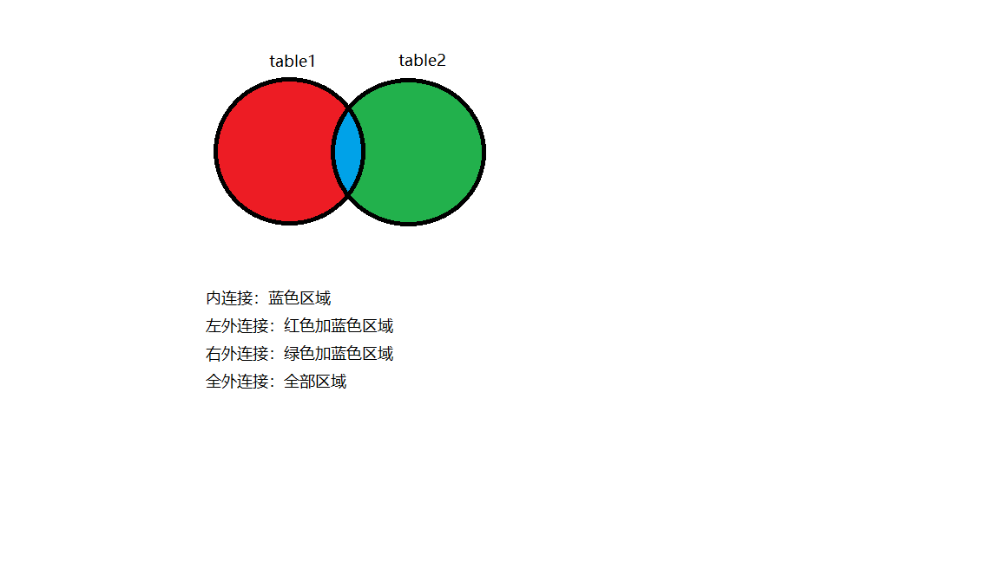
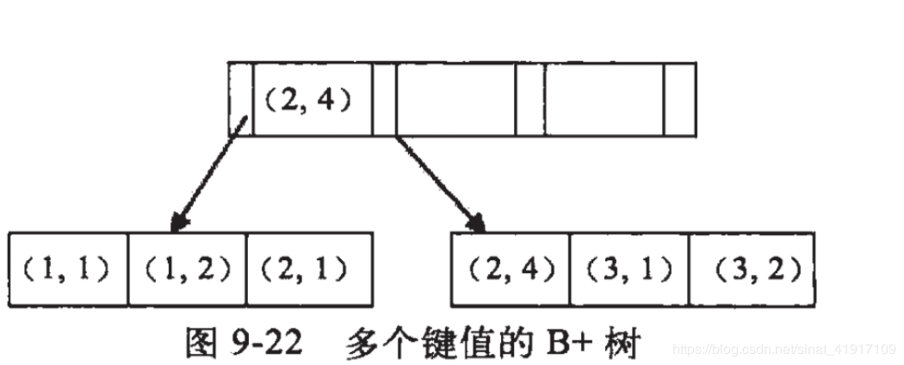
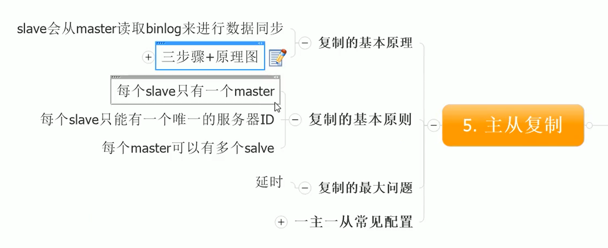

# 一些名词解释

#### DB(database) 数据库

#### DBMS(Database Management System) 数据库管理系统

#### SQL(Structure Query Language) 结构化查询语言

##### DQL(Data Query Language) 数据查询语言（select）

##### DML(Data Manipulation Language) 数据操纵语言 

- INSERT
- UPDATE
- DELETE
- MERGE
- CALL
- EXPLAIN PLAN
- LOCK TABLE

##### DDL(Data Define Language) 数据定义语言 

- CREATE
- ALTER
- DROP
- TRUNCATE
- COMMENT
- RENAME


##### DCL(Data Control Language) 数据控制语言 （grant）

- GRANT 授权
- REVOKE 取消授权

##### TCL(Transaction Control Language) 事务控制语言

- SAVEPOINT 设置保存点
- ROLLBACK 回滚
- SET TRANSACTION


# 一些常用的符号

- `` ： 着重号（tab上面的那个波浪线按键）；用于标识属性；因为有些属性可能会和关键子重名，用着重号可以表示该字段是属性
- #、--（隔一个空格）内容、/* */ ： 这些统统表示注释


# 一些常用的关键字

### 别名

**注意：别名最好使用 "" 括起来**

```mysql
/* 给属性加别名 */
select stu_id id from stu;
select stu_id as id from stu;
/* 给表加别名 */
select stu_id from stu s;
select stu_id id from stu as s;
```

**注意：给表加别名后，该查询语句就只能使用该表的别名进行查询，原表名不能使用**

### 运算符

- 大、小、等于：>、<、=
- <>（ != 也兼容 ）：不等于
- and（&&）、or（||）、not（ ! ）：与、或、非
- between a and b ：闭区间[ a , b ]
- is null：字段为空 （注意：字段为空不能使用 key = null 判断）
- <=> ：安全等于（ key <=> null 可行；<=>包含=和is null的功能）
- \ ：  转义字符（例如\%代表一个%）
- '￥%' escape '￥' ：自定义转义字符（自定义￥为转义字符） 
- 通配符
  - %、* ：匹配0个或多个字符
  - _ ：匹配一个字符
- DISTINCT：去重


# 一些常用的函数

## 工具函数

#### VERSION

```mysql
VERSION();#返回版本号
```

#### DATABASE

```mysql
DATABASE();#返回当前使用的数据库名
```

#### USER

```mysql
USER();#返回当前登陆的用户名
```


## 单行函数

函数对表中每行都执行一次，并返回一个值

### 字符串函数

#### IFNULL

```mysql
IFNULL(key,value); #如果key为空，函数返回value；否则返回key
```

#### LENGTH

```mysql
LENGTH(key); #一个字母、数字或符号占一个字节；一个中文占3个字节
```

#### CONCAT

```mysql
CONCAT(key1,key2,key3,...); #将全部key拼接成一个字符串
```

#### UPPER、LOWER

```mysql
UPPER(key); #全部字母改大写
LOWER(key); #全部字母改小写
```

#### SUBSTR(SUBSTRING)

```mysql
SUBSTR(key,pos); #从下标pos开始截取字符串
SUBSTR(key,pos，len);#从下标pos开始截取字符串，截取长度为len
SUBSTR('你好世界',2);#截取出 ‘好世界’ ；数据库从下标1开始算，截取的是字符数，而不是字节大小
```

#### INSTR

```mysql
INSTR(key,str); #返回str在key中第一次出现的下标；找不到返回0
```

#### TRIM

```mysql
TRIM(key); #去除key左右两端的空格
TRIM('a' from key); #去除key左右两端的字符a
```

#### LPAD、RPAD

```mysql
LPAD(key,len，'a'); #如果key字符长度小于len，则用字符a在左边填充
RPAD(key,len，'a'); #如果key字符长度小于len，则用字符a在右边填充
```

#### REPLACE

```mysql
REPLACE(key,str1,str2); #用str2替换key中全部的str1
```

### 数学函数

#### ROUND

```mysql
ROUND(key); #四舍五入；1.5返回2、1.4返回1；-1.5返回-2、-1.4返回-1
ROUND(key,len);#保留len位小数
```

#### ceil

```mysql
ceil(key); #向上取整；返回大于等于key的第一个整数
```

#### FLOOR

```mysql
FLOOR(key); #向下取整；返回不大于key的第一个整数
```

#### TRUNCATE

```mysql
TRUNCATE(key,n); #保留n位小数
```

#### MOD

```mysql
MOD(a,b); #求余数；公式原型 a - a/b*b
```

#### RAND

```mysql
RAND();#生成随机数
```

### 日期函数

#### NOW

```mysql
NOW(); #返回当前时间和日期，数据类型为date；2020.7.10 22:36:20
```

#### CURDATE、CURTIME

```mysql
CURDATE(); #当前日期
CURTIME(); #当前时间
```

#### DATEDIFF、TIMEDIFF

```mysql
DATEDIFF('yyyy-mm-dd','yyyy-mm-dd');	#相差天数
TIMEDIFF('hh-mm-ss','hh-mm-ss');		#相差秒数
```


#### YEAR、MONTH、DAY、... 、SECOND  

```mysql
YEAR(NOW());#返回当前年份，传入参数为date类型的,也可以是自定义字符串'2020.7.10 22:36:20'这样的格式
...
SECOND(NOW());#返回当前秒数，传入参数为date类型的
```

#### STR_TO_DATE、DATE_FORMAT

```mysql
STR_TO_DATE(key,format); #根据format的格式将key转换成相应的date类型
DATE_FORMAT(key,format);#根据format的格式将key转换成相应的string类型
/*
	%Y：代表4位的年份
    %y：代表2为的年份

    %m：代表月, 格式为(01……12)
    %c：代表月, 格式为(1……12)

    %d：代表月份中的天数,格式为(00……31)
    %e：代表月份中的天数, 格式为(0……31)

    %H：代表小时,格式为(00……23)
    %k：代表 小时,格式为(0……23)
    %h： 代表小时,格式为(01……12)
    %I： 代表小时,格式为(01……12)
    %l ：代表小时,格式为(1……12)

    %i： 代表分钟, 格式为(00……59) 【只有这一个代表分钟，大写的I 不代表分钟代表小时】

    %r：代表 时间,格式为12 小时(hh:mm:ss [AP]M)
    %T：代表 时间,格式为24 小时(hh:mm:ss)

    %S：代表 秒,格式为(00……59)
    %s：代表 秒,格式为(00……59)
*/
```


## 分组函数

**注意：分组函数调用过程中，自动忽略null**

#### SUM

```mysql
SUM(KEY);#求和
SUM(DISTINCT KEY);#去重求和
```

#### AVG

```mysql
AVG(KEY);#求平均
AVG(DISTINCT KEY);#去重求平均
```

#### MIN

```mysql
MIN(KEY);#求最小
MIN(DISTINCT KEY);#去重求最小
```

#### MAX

```mysql
MAX(KEY);#求最大
MAX(DISTINCT KEY);#去重求最大
```

#### COUNT

```mysql
COUNT(KEY);#求总数
COUNT(DISTINCT KEY);#去重求总数
```


# DQL（select）

**如果是联合查询，则会优先执行UNION后面的SELECT、再执行前面的SELECT，最后再执行UNION操作**

## SQL92语句格式

```mysql
#执行顺序
SELECT 						#5.查询目标
DISTINCT key 				#6.去重
FROM table					#1.数据源
[WHERE exp]					#2.查询条件
[GROUP BY key]				#3.按照key分组
[HAVING exp]				#4.调用分组函数后对结果筛选
[ORDER BY key ASC|DESC];	#7.按照key升序|降序排列
[LIMIT offset size]			#8.分页
```

## SQL99语句格式

**注意：FROM连接表时，是从内到外进行连接的，因此后面的表必须于前一张表有关联，否则会连接失败；而且不能用前面的表直接与后面的表进行连接**

例如：**l1 left join l2 on l1.id = l2.id没问题，但是l1 left join l2 on l1.id = l2.id,left join l3 on l1.id = l3.id会失败，因为这里直接跳过了中间表l2令l1、l3进行连接**

```mysql
SELECT 																#5.查询目标
DISTINCT key 														#6.去重
FROM table alias													#1.数据源
[INNER|LEFT OUTER|RIGHT OUTER|CROSS][JOIN table alias ON EXP]		#1.n连接表
[INNER|LEFT OUTER|RIGHT OUTER|CROSS][JOIN table alias ON EXP]		#1.n-1连接表
...				
[INNER|LEFT OUTER|RIGHT OUTER|CROSS][JOIN table alias ON EXP]		#1.2连接表
[INNER|LEFT OUTER|RIGHT OUTER|CROSS][JOIN table alias ON EXP]		#1.1连接表
[WHERE exp]															#2.查询条件
[GROUP BY key]														#3.按照key分组
[HAVING exp]														#4.调用分组函数后对结果筛选
[ORDER BY key ASC|DESC];											#7.按照key升序|降序排列
[LIMIT offset size]													#8.分页

/*
	SQL99连接时，前表或者前面组成的连接表至少存在与后一张表一致的属性，否则连接会失败
	连接方式:
		INNER			内连接
		LEFT [OUTER]	左外~
		LEFT [OUTER]	右外~
		FULL [OUTER]	全外~（不支持）
		CROSS			交叉~
	alias	别名
	EXP		连接条件
*/
```


## 多表连接查询



### 内连接（SQL92、SQL99）

- 等值连接：通过表中具有相同的属性进行连接

SQL92：

```mysql
SELECT key FROM table1 t1,table2 t2
WHERE t1.id = t2.id;
```

SQL99：

```mysql
SELECT key FROM table1 t1
INNER JOIN table2 t2 ON t1.id = t2.id;
```

- 非等值连接：通过表中属性值的包含关系进行连接

SQL92：

```mysql
SELECT key FROM table1 t1,table2 t2
WHERE t1.score BETWEEN t2.maxscore AND t2.minscore;
```

SQL99：

```mysql
SELECT key FROM table1 t1
INNER JOIN table2 t2 ON t1.score BETWEEN t2.maxscore AND t2.minscore;
```

- 自连接

### 外连接

- 左外连接（SQL99）：以左表为主表，将其他子表按照连接条件进行连接；若主表中的元组未能与子表匹配，则对应子表的属性值被设为为null

```mysql
SELECT key FROM table1 t1
LEFT OUTER JOIN table2 t2 ON t1.id = t2.id;
```

- 右外连接（SQL99）：以右表为主表，将其他子表按照连接条件进行连接；若主表中的元组未能与子表匹配，则对应子表的属性值被设为为null

```mysql
SELECT key FROM table1 t1
RIGHT OUTER JOIN table2 t2 ON t1.id = t2.id;
```

- 全外连接：左外连接和右外连接的结合

### 交叉连接（SQL99）

多表的笛卡尔乘积获得的联合表

```mysql
SELECT key FROM table1 t1
CROSS JOIN table2 t2 ON t1.id = t2.id;
```


## 子查询

### 子查询的类型

#### 标量子查询（单行单列）

通常配合使用的符号：> , < , = , ...

```mysql
SELECT singleKey
FROM table
WHERE #筛选条件
```

#### 列子查询（多行单列）

通常配合使用的符号

- IN / NOT IN ：等于列表中的任意一个 / 不等于列表中的任意一个
- any / some (较少用) ：和列表中的某一个做比较，通常和 > , < 一起使用，因此可以用MIN / MAX函数替代
- all  (较少用) ：和列表中的全部做比较比较，通常和 > , < 一起使用，因此可以用MIN / MAX函数替代

```mysql
SELECT singleKey
FROM table
WHERE #筛选条件
```

#### 行子查询（单行多列）

```mysql
SELECT key1,key2,key3,...
FROM table
WHERE #筛选条件
```

#### 表子查询（多行多列）

```mysql
SELECT key1,key2,key3,...
FROM table
WHERE #筛选条件
```

### 子查询位置

### select 之后（标量子查询）

```mysql
SELECT 
(SELECT singlekey FROM table where /*WHERE #筛选条件*/)
FROM table WHERE #筛选条件
```

### from 之后（表子查询，需要起别名）

```mysql
SELECT key1,key2,...
FROM (SELECT singlekey FROM table where /*WHERE #筛选条件*/) alias
WHERE #筛选条件
```

### where或having 之后（标量子查询（常用）、列子查询（常用）、行子查询（较少用））

```mysql
SELECT key1,key2,...
FROM table
WHERE key IN|NOT IN (SELECT key1,key2,... FROM table where /*WHERE #筛选条件*/)
HAVING key IN|NOT IN (SELECT key1,key2,... FROM table where /*WHERE #筛选条件*/)
```

```mysql
SELECT key1,key2,...
FROM table
WHERE key >|<|= ANY|SOME|ALL(SELECT key1,key2,... FROM table where /*WHERE #筛选条件*/)
HAVING key >|<|= ANY|SOME|ALL(SELECT key1,key2,... FROM table where /*WHERE #筛选条件*/)
```

### exists 之后（全部）

exists是一个bool类型关键字。关键子后跟的子查询，只要子查询有数据，则exists返回true

```mysql
SELECT key1,key2,...
FROM table
exists(SELECT key1,key2,... FROM table where /*WHERE #筛选条件*/);
```


## 分页查询

```mysql
SELECT key1,key2,...
FROM table
LIMIT offset size;
```

- offset ：分页起始下标（**从0开始，不是数据库默认的1**）
- size：长度

从第n页开始查的一般公式
$$
LIMIT (n - 1) * size, size
$$


## 联合查询 UNION

联合查询将多个查询结果汇合成一个表

1. 联合查询的查询语句中查询结果的列项长度必须相同
2. 联合查询会将重复项去除（ UNION ALL 声明不去重 ）
3. （建议）各个查询语句的查询结果的列属性最好有相同的意思，否则联合表会意义不明

```mysql
SELECT id1,name1,age1 from table1
UNION [ALL]
SELECT id2,name2,age2 from table2
UNION [ALL]
SELECT id3,name3,age3 from table3
...
```


# DML（增、删、改）

## INSERT 插入

推荐：

```mysql
INSERT INTO table(key1,key2,...)
VALUES (val1,val2,val3,...),
(val1,val2,val3,...),		#如果需要插入多行
...

INSERT INTO table(key1,key2,...)
SELECT (key1,key2,...) FROM table2	#可以插入单行或多行
WHERE /*筛选条件*/
```

另一种方法：

```mysql
INSERT INTO table(key1,key2,...)
SET key1=val1,
SET key2=val2,
...
```

**局限性：不支持一次插入多行，也不支持插入子查询**


## UPDATE 改

### 单表

```mysql
UPDATE table
SET key1=val1,key2=val2,...
WHERE 	#筛选条件
```

### 多表

SQL92：

```mysql
UPDATE table
SET key1=val1,key2=val2,...
WHERE 	#连接条件(筛选条件)
AND 	#筛选条件
```

SQL99：

```mysql
UPDATE table1 alias1
INNER | LEFT|RIGHT OUTER | CROSS JOIN table2 alias2 ON #连接条件
INNER | LEFT|RIGHT OUTER | CROSS JOIN table3 alias3 ON #连接条件
...
SET key1=val1,key2=val2,...
WHERE 	#筛选条件
```


## DELETE、TRUNCATE 删

### 单表

```mysql
DELETE FROM table
WHERE #筛选条件
```

### 多表

SQL92：

```mysql
DELETE alias 	#删哪个表就写它的别名
FROM table1 alias1,table2 alias2,...
WHERE 	#连接条件(筛选条件)
AND 	#筛选条件
```

SQL99：

```mysql
DELETE alias	#删哪个表就写它的别名
FROM table1 alias
INNER | LEFT|RIGHT OUTER | CROSS JOIN table2 alias2 ON #连接条件
INNER | LEFT|RIGHT OUTER | CROSS JOIN table3 alias3 ON #连接条件
...
WHERE 	#筛选条件
```

### TRUNCATE 与 DELETE 的区别

```mysql
TRUNCATE TABLE table; #直接清空该表
```

- TRUNCATE直接清空表，而DELETE可以选择性地删除表中数据
- TRUNCATE更加高效
- （主要）如果表中存在自增长属性，DELETE删除后，使用INSERT会从自增值的断点继续增长；而用TRUNCATE清空表，会将自增值的断点重置为1
- 在事务处理中，delete操作可以回滚，truncate无法回滚


# DDL （CREATE、DROP、ALTER）

## 库管理

```mysql
CREATE DATABASE [IF NOT EXISTS] db;		#建库
DROP DATABASE [IF EXISTS] db;			#删库
ALTER DATABASE db CHARACTER SET utf8;	#修改库的属性
RENAME DATABASE db TO newdb;			#重命名数据库(已弃用)
```

## 表管理

```mysql
#建表
CREATE TABLE [IF NOT EXISTS] tb(
	name type [/*约束*/],
    name type [/*约束*/],
    ...
);

#删表
DROP TABLE [IF EXISTS] tb;

#显示表属性
DESC tb;
SHOW CREATE TABLE tb;

#修改表
ALTER TABLE tb CHANGE [COLUMN] oldname newname type;	#修改列名
ALTER TABLE tb MODIFY [COLUMN] name newtype;			#修改列类型、列约束
ALTER TABLE tb ADD [COLUMN] name type;					#添加列		
ALTER TABLE tb DROP [COLUMN] name;						#删除列
ALTER TABLE tb RENAME TO newtb;							#修改表名

#表的复制
CREATE TABLE cptb LIKE tb;		#表cptb拥有和tb一样的列名、列属性结构，但是没有数据
CREATE TABLE cptb				#表cptb拥有和tb一样的列名、列属性结构，同时拥有数据
SELECT * FROM tb;

CREATE TABLE cptb				#从tb复制部分属性到cptb
SELECT key1,key2,...
FROM tb
[WHERE 0];						#如果不需要复制数据，可以使子查询不包含数据
```


# 数据类型

| 类型                   | 存放类型                     | 占用字节             | 取值范围                                          |
| ---------------------- | ---------------------------- | -------------------- | ------------------------------------------------- |
| TinyInt                | 整型                         | 1                    | 有符号：-128~127 <br />无符号：0~255              |
| Smallint               | 整型                         | 2                    | 有符号：-32768~32767<br />无符号：0~65535         |
| MediumInt              | 整型                         | 3                    |                                                   |
| Int、Integer           | 整型                         | 4                    |                                                   |
| bigInt                 | 整型                         | 8                    |                                                   |
| type unsigned          | 无符号类型                   | -                    |                                                   |
|                        |                              |                      |                                                   |
| float                  | 浮点型                       | 4                    |                                                   |
| double                 | 浮点型                       | 8                    |                                                   |
| dec(M,D)、decimal(M,D) | 定长浮点型                   | M+2                  | 取值范围和double一致                              |
|                        |                              |                      |                                                   |
| char(M)                | 定长字符型                   | M（可省略，默认为1） | M：0~255                                          |
| varchar(M)             | 变长字符型                   | 0~M                  | M：0~65535                                        |
| text                   | 较长的文本字符串             |                      |                                                   |
|                        |                              |                      |                                                   |
| binary(M)              | 定长二进制文本               | M                    |                                                   |
| varbinary(M)           | 变长二进制文本               | 0~M                  |                                                   |
| **blob**               | 较长的二进制文本             |                      | 通常用来存储.jpg .avi等大型文件                   |
|                        |                              |                      |                                                   |
| enum                   | 枚举（枚举内容不区分大小写） |                      |                                                   |
| set                    | 集合                         |                      |                                                   |
|                        |                              |                      |                                                   |
| date                   | 日期型                       | 4                    | '1000-01-01'~'9999-12-31'                         |
| datetime               | 日期、时间                   | 8                    | '1000-01-01 00:00:00'~<br />'9999-12-31 23:59:59' |
| timestamp              | 日期、时间                   | 4                    | '19700101080001'~2038的某一时刻                   |
| time                   | 时间                         | 3                    |                                                   |
| year                   | 年份                         | 1                    |                                                   |

## 整型

```mysql
INT(M) ZEROFILL	#0左填充，且ZEROFILL类型有UNSIGNED的效果 
```

## 浮点型

```mysql
FLOAT(D,M)		#默认情况下，float和double的D、M是省略的，具体值根据输入的值进行修改
DOUBLE(D,M)

DEC(D,M)		#D代表整数位和小数位的总和，所以整数位不得大于(D-M)，小数位不得大于M
```

## 字符型

- char是固定长度的；varchar会根据插入的值自动调整长度
- varchar节省空间；char高效

## 集合类型

```mysql
ENUM('key1','key2',...); 	#枚举类型选取其中一个枚举值进行赋值
#例 em ENUM('a','b','c');	em = 'a';
SET('key1','key2',...);		#集合类型选取一个或多个值进行赋值
# st SET('a','b','c');		st = ('a','b');
```

## 时间类型

```mysql
# 主要类型 : datetime	timestamp
# datatime的时间范围跨度更加大('1000-01-01')
# timestamp会受时区影响，更加灵活；同时也会受到MySQL的版本影响

tsp TIMESTAMP;
tsp = NOW();	#假设此时时间为2020-7-12 21:17:00；时区为东八区
SET TIME_ZONE = '+9:00';#设置时区为东九区
SELECT tsp;		#此时时间变为2020-7-12 22:17:00
```


# 约束

## 六大约束

- NOT NULL ：非空约束
- DEFAULT ：默认约束
- PRIMARY KEY ：主键
- UNIQUE ：唯一约束
- FOREIGN KEY ：外键
- CHECK ：检查约束（MySQL不支持；加了不报错，但没用）


### 主键和唯一键的区别

- 主键具有非空约束；唯一键不具有
- 一个表中，主键至多一个，唯一键不限定数量


### 外键

- 外键引用的字段必须是 **一个键（主键、外键、唯一键或者自定义键）** 
- 设置外键的表称为**从表**，外键引用的的字段所属的表称为**主表**。插入时，外键的值要么为NULL，要么为主表中对应字段的值。删表时，要先删除从表，再删除主表


## 列级约束和表级约束

- 列级约束：除外键以外，都可以添加
- 表级约束：除非空约束和默认约束以外，都可以添加

```mysql
CREATE TABLE IF NOT EXISTS tb(
	name type /* 列级约束 */,
    name type /* 列级约束 */,
    ... ,
    /* 表级约束 */,
    /* 表级约束 */,
	...
);

#书写格式
/* 列级： */ CONSTRAINT alias NOT NULL | DEFAULT val | PRIMARY KEY | UNIQUE
/* 表级： */ CONSTRAINT alias PRIMARY KEY | UNIQUE (/* 字段名 */)
/* 外键： */ CONSTRAINT alias FOREIGN KEY (/*字段名*/) REFERENCES /*表名*/(/*字段名*/)
```


## 修改约束

### 修改列级约束

```mysql
#修改约束
ALTER TABLE tb MODIFY [COLUMN] name type constraints
```

### 修改表级约束

```mysql
#添加约束
ALTER TABLE tb ADD CONSTRAINT alias PRIMARY KEY | UNIQUE (/* 字段名 */);
#添加外键
ALTER TABLE tb ADD CONSTRAINT alias FOREIGN KEY (/*字段名*/) REFERENCES /*表名*/(/*字段名*/);

#删除约束
ALTER TABLE tb DROP PRIMARY KEY;	#主键唯一
ALTER TABLE tb DROP UNIQUE KEY(/*字段名*/);
ALTER TABLE tb DROP alias;			#通过约束别名删除约束

# 注意：定义外键时，如果自定义的别名，删除该外键后，最好把别名的索引也删除(即使此时外键约束已不存在)
```


## 自增长约束（标识列）

- 自增长约束只能用在数值型上（整型、浮点型）
- 自增长约束只能用在键（主键、唯一键、外键和自定义键）上
- 一个表中至多有一个标识列

```mysql
name INT AUTO_INCREMENT;

#查看增长初始值和步长
SHOW VARIABLES LIKE 'auto_increment%';
# auto_increment_increment 默认步长 可以通过set修改
# auto_increment_offset	起始位置 MySQL不支持修改该值
```


# TCL 事务

## 事务的ACID属性

### 原子性（Atomicity）

原子性是指事务是一个不可分割的工作单位，事务中的操作要么都发生，要么都不发生。 

### 一致性（Consistency）

事务必须使数据库从一个一致性状态变换到另外一个一致性状态。

### 隔离性（Isolation）

事务的隔离性是多个用户并发访问数据库时，数据库为每一个用户开启的事务，不能被其他事务的操作数据所干扰，多个并发事务之间要相互隔离。

### 持久性（Durability）

持久性是指一个事务一旦被提交，它对数据库中数据的改变就是永久性的，接下来即使数据库发生故障也不应该对其有任何影响。


## 事务的隔离级别

多个事务一起执行时，往往会引发一些并发问题，常见的并发问题有：

- 脏读（UPDATE）：假设有两个事务T1、T2，T1修改了某一个值，但未COMMIT；如果此时T2读取了该值，T1回滚事务，那么T2读取的值就是临时且无效的
- 不可重复读（UPDATE）：假设有两个事务T1、T2，T1读取了某个值，此时T2修改了该值并且提交了事务；此时T1再次读取该值，就会读出一个不同的值
- 幻读（INSERT）：假设有两个事务T1、T2，T1读取了一些字段，此时T2往表中插入新数据，并提交；此时T1再次读取这些字段会发现突然多出几行


针对这些并发问题，各自对应的隔离级别：

- READ UNCOMMITTED（读未提交数据）：最低的隔离级别。允许事务读取未被其他事务提交的变更。上述的并发问题均可以发生
- READ COMMITTED（读已提交数据）：只允许事务**读取已被其他事务提交的变更**。可以避免**脏读**，当不可重复读和幻读无法解决
- REPEATABLE READ（可重复读）：确保事务可以多次从一个字段中读取相同的值。在这个事务持续期间，**禁止其他事务对这个字段进行更新**。可以避免**脏读**和**不可重复读**，但幻读问题仍然存在
- SERIALIZABLE（串行化）：确保事务可以从一个表中读取相同的行。在这个事务持续期间，**禁止其他事务对该表执行插入、更新和删除操作**。所有并发问题都可以避免，但性能十分低下

```mysql
SELECT @@tx_isolation;		#显示当前隔离级别
#设置当前连接的隔离级别
SET SESSION TRANSACTION ISOLATION LEVEL READ UNCOMMITTED | READ COMMITTED | REPEATABLE READ | SERIALIZABLE;
#设置全部连接的隔离级别
SET GLOBAL TRANSACTION ISOLATION LEVEL READ UNCOMMITTED | READ COMMITTED | REPEATABLE READ | SERIALIZABLE;
```


## 事务处理

```mysql
SET AUTOCOMMIT = 0;			#开启事务
[START TRANSACTION;]		#开启事务，可省略
/*
	执行语句1,
*/
SAVEPOINT point;			#设置回滚点
/*
	执行语句2,
	...
*/
COMMIT;						#提交事务
ROLLBACK;					#或者选则回滚
ROLLBACK point;				#定点回滚
```


## delete和truncate在事务中的区别

- delete可以利用ROLLBACK撤销删除操作
- truncate无法撤销


# 视图

视图是根据实体表动态生成的虚拟表。视图并不保存数据，只保存SQL逻辑

优点：

- 重用SQL语句
- 简化复杂的SQL语句，隐藏实现细节，保护数据，提高安全性

```mysql
#创建视图
CREATE VIEW v 
AS SELECT /* 查询语句 */

#查看视图
DESC v;
SHOW CREATE VIEW v;
SELECT (key1,key2,...) FROM v;

#修改视图
CREATE OR REPLACE VIEW v
AS SELECT /* 查询语句 */

#删除视图
DROP VIEW v;
```


### 视图的更新

原理：因为可以对视图进行INSERT、UPDATE、DELETE操作，而进行这些操作时，用于创建的实体表也会因此而被修改。因此可以通过修改视图从而达到修改表的功能

注意，以下情况不能实现视图的更新：

- 包含以下关键字的sql语句：分组函数、DISTINCT、GROUP BY、HAVING、UNION或者UNION ALL

- 常量视图（例如：SELECT 1;）

- JOIN（连接表）

- FROM一个不能更新的视图

- WHERE子句的子查询引用了FROM子句中的表

  - ```mysql
    SELECT key FROM tb
    WHERE key IN (
    	SELECT key FROM tb
    );
    ```


# 变量

## 系统变量

- 全局变量（每个连接公用的变量）
- 会话变量（仅对当前连接有效的变量）

```mysql
#查看变量
SHOW SESSION | GLOBAL VARIABLES;
SELECT @@SESSION. | @@GLOBAL. /* 变量名 */ #注意，SESSION和GLOBAL后面要加一个.

#赋值
#设置时如果不指定SESSION或者GLOBAL,默认设置SESSION变量
SET SESSION | GLOBAL name = val;
SET @@SESSION. | @@GLOBAL. name = val;
```


## 自定义变量

- 用户变量（用户定义的，对当前连接有效的变量）

```mysql
#声明、初始化和赋值
SET @name = val;
SET @name := val;
SELECT @name := val;

#赋值的另外一种操作
SELECT key INTO name FROM tb;
SELECT key1,key2,key3,... INTO name1,name2,name3,... FROM tb;#给多个变量赋值；key1赋值给name1，key2赋值给name2...

#查看
SELECT @name;
```

- 局部变量（只能创建在BEGIN-END结构中，仅对该结构里面的内容有效）

```mysql
#声明和初始化
DECLARE name type [DEFAULT val];

#赋值
SET name = val;			#这里和用户变量不一样，不需要加@
SET name := val;		#这里和用户变量不一样，不需要加@
SELECT @name := val;	#SELECT的赋值方法与用户变量一致
SELECT key INTO name FROM tb;
SELECT key1,key2,key3,... INTO name1,name2,name3,... FROM tb;#给多个变量赋值;key1赋值给name1，key2赋值给name2...
```


# 存储过程

SQL语句需要先编译然后执行，而存储过程（Stored Procedure）是一组为了完成特定功能的SQL语句集，经编译后存储在数据库中，用户通过指定存储过程的名字并给定参数（如果该存储过程带有参数）来调用执行它。

作用：

- 增强SQL语言的功能和灵活性：存储过程可以用控制语句编写，有很强的灵活性，可以完成复杂的判断和较复杂的运算。
- 标准组件式编程：存储过程被创建后，可以在程序中被多次调用，而不必重新编写该存储过程的SQL语句。而且数据库专业人员可以随时对存储过程进行修改，对应用程序源代码毫无影响。
- 较快的执行速度：如果某一操作包含大量的Transaction-SQL代码或分别被多次执行，那么存储过程要比批处理的执行速度快很多。因为存储过程是预编译的。在首次运行一个存储过程时查询，优化器对其进行分析优化，并且给出最终被存储在系统表中的执行计划。而批处理的Transaction-SQL语句在每次运行时都要进行编译和优化，速度相对要慢一些。
- 减少网络流量：针对同一个数据库对象的操作（如查询、修改），如果这一操作所涉及的Transaction-SQL语句被组织进存储过程，那么当在客户计算机上调用该存储过程时，网络中传送的只是该调用语句，从而大大减少网络流量并降低了网络负载。
- 作为一种安全机制来充分利用：通过对执行某一存储过程的权限进行限制，能够实现对相应的数据的访问权限的限制，避免了非授权用户对数据的访问，保证了数据的安全。


## 存储过程的使用

**由于存储过程中的语句需要添加；，所以使用之前，需要将结束标记符号更改一下。使用DELIMITER进行更改（用完记得复原）**

```mysql
DELIMITER $		#修改结束标记
#参数列表格式 	IN | OUT | INOUT name type
# IN:向里面传入的参数	OUT:传出参数，类似于返回值		INOUT:二者兼顾
CREATE PROCEDURE pc( /* 参数列表 */ )
BEGIN		#如果只有一句SQL语句，可以省略BEGIN和END
	DECLARE name type [DEFAULT val];	#声明局部变量
	DECLARE name type [DEFAULT val];	#声明局部变量
	...
	
	/* SQL语句 */
	/* SQL语句 */
	/*
		如果传入的参数是OUT或者INOUT的，假设该参数为arg
		可以通过SELECT赋值方法给变量赋值，然后传出
		SELECT key INTO arg FROM tb;
	*/
	
	...
END $	#记得使用修改后的符号结束创建

#调用
CALL pc( /* 参数名 */ );

#删除
DROP PROCEDURE pc;

#查看
SHOW CREATE PROCEDURE pc;
# DESC 不支持查看存储过程
```


# 函数

**和存储过程一样，函数也需要修改结束标记**

```mysql
DELIMITER $

# 创建
# 函数的参数列表只包含name和type，不需要添加参数模式IN|OUT|INOUT，因为函数默认带返回值
# RETURNS表示返回值类型，RETURN表示返回值
CREATE FUNCTION fn( /* 参数列表 */ ) RETURNS type
BEGIN		#如果只有一句SQL语句，可以省略BEGIN和END
	DECLARE name type [DEFAULT val];	#声明局部变量
	DECLARE name type [DEFAULT val];	#声明局部变量
	...
	
	/* SQL语句 */
	/* SQL语句 */
	...
	
	RETURN name; #返回一个自定义变量，或者传入的参数
END $

#调用
SELECT fn( /* 参数名 */ );

#删除
DROP FUNCTION fn;

#查看
SHOW CREATE FUNCTION fn;
```


### 存储结构和函数的区别

- 存储结构可以不带返回值，也可以带一个或多个返回值，这取决于传入参数；函数必须返回且只返回一个返回值


# 控制结构

## IF

```mysql
IF(exp,val1,val2);#等价于  exp ? val1 : val2

#IF-ELSE结构，注意只能用在BEGIN-END结构里面
BEGIN
    IF /* 条件 */ THEN operator;
        ELSEIF /* 条件 */ THEN operator;
        ELSEIF /* 条件 */ THEN operator;
        ELSE operator;
    END IF
END
```

## CASE

- 作为表达式，例如防止WHERE后、SELECT后这些情况下，可以使用
- 如果作为单独的语句使用，则必须放在BEGIN-END结构中

```mysql
#类switch结构
CASE exp
WHEN val1 THEN operator1	#如果exp=val1，执行operator1
WHEN val2 THEN operator2
ELSE operator3	#switch中的default
END

#if-else结构
CASE
WHEN exp1 THEN operator1	#如果exp1为真，则执行operator1；如果operator是一个语句，需要加上;
WHEN exp2 THEN operator2
ELSE operator3
END
```

## WHILE、LOOP、REPEAT

**循环结构必须放在BEGIN-END结构中**

```mysql
BEGIN

	[name:]/* 循环名 */ WHILE /*循环条件*/ DO
		/* 循环体 */
		[ITERATE name;]		#continue，需要配合循环名一起使用
		[LEAVE name;]		#break，需要配合循环名一起使用
		/* 循环体 */
	END WHILE [name];
	
	[name:]/* 循环名 */ LOOP		#loop是一个死循环，需要配合LEAVE进行终止
		/* 循环体 */
		[ITERATE name;]		
		[LEAVE name;]		
		/* 循环体 */
	END LOOP [name];
    
    [name:]/* 循环名 */ REPEAT		#repeat类似于do-while
		/* 循环体 */
		[ITERATE name;]		
		[LEAVE name;]		
		/* 循环体 */
		
		UNTIL /* 退出条件(即满足条件就退出),不加分号 */
	END REPEAT [name];
	
END
```


# 索引

**索引是什么？索引是一种特殊的文件(InnoDB数据表上的索引是表空间的一个组成部分)，它们包含着对数据表里所有记录的引用指针。也可以理解为索引是一种排好序的、用于快速查找的数据结构**


## 底层结构

**如果没有特别指明，都是指B树（即多路搜索树）结构组织的索引。**其中聚集索引、次要索引、覆盖索引、复合索引、前缀索引、**唯一索引**都是使用B+树索引。除此之外还有哈希索引等。


## 优缺点

- 优
  - 提高检索的效率，降低数据库的IO成本
  - 降低数据排序的成本，降低了CPU的消耗
- 缺
  - 一般来说索引本身也很大，因此索引往往以索引文件的形式存储在磁盘中，因此会占用一定的资源
  - 虽然索引大大提高了查询速度，但同时也会降低更新表的速度。因为对表进行插入（INSERT）、更新（UPDATE）和删除（DELETE）操作时，不仅要修改表中数据，还要修改索引中因为修改表而变动的索引的信息
  - 需要人力和时间去建立和维护索引


## 索引类型

- 单指索引：一个索引只包含单个列，一个表可以有多个单列索引
- 唯一索引：索引列的值必须唯一，但允许有空值
- 复合索引：一个索引包含多个列


## 索引的使用

```mysql
#创建
CREATE [UNIQUE] INDEX idx_tb_name ON tb(key1,key2,...);

#删除
DROP INDEX [idx_tb_name] ON tb;
ALTER TABLE tb DROP INDEX idx;

#查看
SHOW INDEX FROM tb[\G]; #默认按表格式输出，\G是按列表形式输出

#修改
ALTER TABLE tb ADD PRIMARY KEY(name);#添加主键，默认生成索引，索引名是主键名
ALTER TABLE tb ADD CONSTRAINT fk FOREIGN KEY tb(name) REFERENCES tb2(name);#添加外键，默认生成索引，索引名为约束名
ALTER TABLE tb ADD UNIQUE idx_name(name);#添加唯一索引 
ALTER TABLE tb ADD INDEX idx_name(name);#添加普通索引
ALTER TABLE tb ADD FULLTEXT idx_name(name);#该语句指定了索引为FULLTEXT，用于全文索引
```


## 应用场景

- 适合建索引
  - 主键、外键自动建立唯一索引
  - 频繁作为查询条件的字段应该创建索引
  - 在高并发下尽量选择复合索引而非单值索引
  - 查询中需要排序的字段
  - 查询中需要统计或者分组的字段
- 不适合的情况
  - 频繁更新的字段
  - WHERE后面用不到的字段
  - 表记录太少
  - 数据重复且分布均匀的字段（如性别、较短的枚举类型等）


## 索引效率的计算

$$
索引效率 = N(表中总数据) / n(表中去重后的数据)
$$

假如索引列中有2000条数据，其中不重复的索引列有1980个，那么所有效率就是(1980 / 2000) = 0.99
一个索引的选择性越接近于1，索引的效率就越高


## 覆盖索引

解释：

1. SELECT的数据列只需要从索引中就能够取得，不必读取数据行；MySQL可以利用索引返回SELECT列表中的字段，而不必根据索引再次读取数据文件，换句话说就是 **查询列要被所建的索引覆盖**
2. 索引是高效找到行的一个方法，但是一般数据库也能使用索引找到一个列的数据，因此它不必读取整个行。毕竟索引叶子节点存储了它们索引的数据。当能通过读取索引就可以得到想要的数据，那就不需要读取行了。一个索引包含了（或覆盖了）满足查询结果的数据就叫做覆盖索引

**注意：如果要使用覆盖索引，一定要注意SELECT列表中取出需要的列，尽量避免SELECT*。因为将所有字段一起做索引会导致索引文件过大，降低查询性能**


# EXPLAIN 执行计划

使用EXPLAIN关键子可以模拟优化器执行SQL查询语句，从而知道MySQL是如何处理你的SQL语句的。用于分析你的查询语句或者是表结构的性能瓶颈


## EXPLAIN表项解释

### id（重点）

SELECT查询的序列号，包含一组数字，表示查询中执行SELECT子句或操作表的顺序

- id相同：执行顺序由上至下
- id不同：如果是子查询，id的值会递增；id的值越大，优先级越高，越先被执行
- id既有相同的，又有不同的：先执行高级的，同级的由上至下执行

### select_type

- SIMPLE：简单的SELECT查询，查询中不包含子查询或UNION
- PRIMARY：查询中若包含任何复杂的子部分，最外层查询会被标记为PRIMARY

```mysql
#这个语句包含子查询，那么第一个子查询会被标记为PRIMARY，第二个是子查询，会被标记为SUBQUERY
SELECT * FROM tb1 WHERE key IN (SELECT * FROM tb2);
```

- SUBQUERY：主查询中包含了子查询，那么该子查询会被标记为SUBQUERY
- DERIVED：FROM列表中包含了子查询（临时表），那么该子查询被标记为DERIVED
- UNION：若第二个SELECT出现在UNION之后，该查询被标记为UNION；如果UNION包含在FROM子句的子查询中，外层SELECT将被标记为DERIVED
- UNION RESULT：从UNION表获取结果的SELECT

### table

显示这一行数据是属于哪张表的

### type（重点）

访问类型

性能优势：system > const > eq_ref > ref > range > index > ALL

(了解) 	system > const > eq_ref > ref > fulltext > ref_or_null > index_merge > unique_subquery > index_subquery > range > index > ALL


各访问类型的解释：

- system：访问的表中，只有一条数据
- const：通过主键或唯一键，利用等值条件访问；访问结果只包含一条记录

```mysql
#假设id是一个主键或者唯一键
SELECT * FROM tb WHERE id=1;
#结果只会返回id为1的一条数据
```

- eq_ref：通过主键或唯一键的值，利用等值条件访问另一张表的主键或唯一键；访问结果只包含一条记录

```mysql
#假设id1是t1的主键，id2是t2的主键
SELECT * FROM t1,t2 WHERE t1.id1 = t2.id2;
```

- ref：等值访问非主键或唯一键；访问结果有一条或者多条

```mysql
#name只是一个普通字段，不是主键或唯一键
SELECT * FROM tb WHERE name='abc';
```

- range：非等值访问；利用 > < IN 这些带有模糊查询味道的进行查询
- index：利用索引对整表进行访问
- ALL：全表访问

### possible_keys

- 表示可能应用在这张表的索引，一个或多个
- 查询涉及到的字段上若存在索引，则该索引将被列出，**但不一定被实际使用**

### key（重点）

- 实际使用的索引。如果为null，则表示没用索引
- **查询中若使用了覆盖索引，那么possible_key中将不会显示该索引，该索引只会出现在key这里；如果possible_key显示了NULL，而key不是NULL，就意味着使用了覆盖索引**

### key_len

- 表示索引中使用的字节数，可通过该列计算查询中使用的索引长度。在不损失精确性的情况下，越短越好
- key_len显示的值为索引字段的最大可能长度，**并非实际使用长度**

### ref

显示索引的哪一列被使用了，如果可能的话，是一个常数。哪些列或常量被用于查找索引列上的值

### rows（重点）

根据表统计信息及索引选用情况，大致估算出找到所需的记录所需要读取的行数；**和索引长度key_len有关，越长，rows的值理论上越少**

### Extra（重点）

包含不适合在其他列中显示，但十分重要的额外信息

#### Extra的值

- **Using filesort**（表示该语句比较糟糕，需要优化）：会发生在使用ORDER BY的语句中。说明MySQL会对数据使用一个外部的索引排序，而不是按照表内的索引顺序进行读取

```mysql
# 假设有一个联合索引
CREATE INDEX idx ON tb(key1,key2,key3,...);

# 根据最左匹配原则，key1不同的情况下，key2的值不一定是排序的;key2不同的情况下，key3也不一定是排序的；
# 所以对于联合索引来说，只有当前面的索引匹配了，后面的索引才是有序的
# 因为索引是已排序的，索引Using filesort会出索引匹配不完整的情况下，即从左往右匹配索引时，中间出现了断层，有索引未被匹配 
# 这些情况下，并没有使用到索引，Extra会显示Using filesort
SELECT * FROM tb ORDER BY key2,key3;			#key1未被匹配
SELECT * FROM tb WHERE key1=val ORDER BY key3;	#key2未被匹配
SELECT * FROM tb WHERE key1 < 2 ORDER BY key2,key3;#因为key1是范围匹配，索引不生效，就相当于key1未匹配

# 正确示范
SELECT * FROM tb WHERE key1=val1 ORDER BY key2,key3;
SELECT * FROM tb ORDER BY key1,key2,key3;
SELECT * FROM tb WHERE key1=val1 AND key2=val2 ORDER BY key3;
SELECT * FROM tb WHERE key1 < 2 ORDER BY key1,key2,key3;#这个索引是从ORDER BY的key1开始匹配的
```

- **Using  temporary**（表示该语句很糟糕，必须优化）：使用了临时表保存中间结果，即MySQL在对查询结果排序时使用了临时表。常见于排序ORDER BY和分组查询GROUP by

```mysql
# 因为GROUP BY在分组的时候，会先进行排序；所以如果用索引进行分组，可以提高速度；否则需要先进行排序，再根据排序结果进行下一步操作
# 和Using filesort原理差不多，如果复合索引前一部分的索引未能匹配，后面的索引就会失效
# 这些情况下，并没有使用到索引，Extra会显示Using temporary
SELECT COUNT(key1) GROUP BY key2;	#key1未匹配
SELECT COUNT(key1) WHERE key1 < 2 GROUP BY key3;#key2未匹配
...
#基本都和Using filesort的情况差不多
```

- **Using index**
  - 表示相应的SELECT操作使用了覆盖索引（Covering Index），即索引能够正确匹配，避免了访问表中数据的操作
  - 如果同时出现using where，表示索引被用来执行**索引键值的查找**
  - 如果没有出现using where，表示索引用来**读取数据**而并非执行查找动作
- Using where：表明使用了where筛选
- Using join buffer：使用了连接缓存
- impossible where：使用了形如 where 0 这些永假筛选条件
- select tables optimized away：在没有GROUP BY子句的情况下，基于索引优化MIN/MAX操作或者对于MyISAM存储引擎优化COUNT(*)操作，不必等到执行阶段再进行计算，查询执行计划生成的阶段即完成优化
- distinct：在找到第一匹配的元组后即停止找同样值的动作


# 索引优化（重点）

## 最左匹配原则（最佳左前缀法则）

索引的底层是一颗B+树，那么联合索引当然还是一颗B+树，只不过联合索引的健值数量不是一个，而是多个。构建一颗B+树只能根据一个值来构建，因此数据库依据联合索引最左的字段来构建B+树。
例子：假如创建一个（a,b)的联合索引，那么它的索引树是这样的



可以看到a的值是有顺序的，1，1，2，2，3，3，而b的值是没有顺序的1，2，1，4，1，2。所以b = 2这种查询条件没有办法利用索引，因为联合索引首先是按a排序的，b是无序的。

同时我们还可以发现在a值相等的情况下，b值又是按顺序排列的，但是这种顺序是相对的。所以最左匹配原则遇上范围查询就会停止，剩下的字段都无法使用索引。例如a = 1 and b = 2 a,b字段都可以使用索引，因为在a值确定的情况下b是相对有序的，而a>1and b=2，a字段可以匹配上索引，但b值不可以，因为a的值是一个范围，在这个范围中b是无序的。

**最左匹配原则：**最左优先，以最左边的为起点任何连续的索引都能匹配上。同时**遇到范围查询(>、<、between、like)就会停止匹配**。

因此匹配的时候尽可能得**按顺序（key1,key2和key2,key1是同一顺序，只要不出现中断，就能成功匹配）**的等值匹配，如果中间的索引未能匹配，那么只会使用前半部分的索引进行索引查询


## 索引优化策略

- 使用连接查询时，在子表对连接条件添加索引（小表驱动大表）可以提高查询效率；因为一般主表都是需要全表访问的，因此要想提高整体的查询效率，就需要通过在子表中添加索引的方式，提高子表的查询效率，进而提高整体的查询效率

- 尽量使用全值匹配，即**按顺序（key1 and key2和key2 and key1是同一顺序，只要不出现中断，就能成功匹配）**的等值匹配
- 不在索引列上做任何操作（计算、函数、（显式或隐式）类型转换），这些操作会导致索引失效而转向全表扫描
- 索引匹配中断后，MySQL将不会对右边的索引进行索引查找，而是在临时结果表中全表查找
- 尽量使用覆盖索引，减少使用SELECT* ；因为使用**SELECT*最坏的情况是全表扫描（ALL）**，即**索引失效**；而使用**覆盖索引，可以将查询类型控制在INDEX**
- 使用!=、<>、is null、is not null将会使索引中断匹配
- 使用like配合通配符进行模糊查询
  - like '%abc%'：会终止匹配
  - like '%abc'：终止匹配
  - like 'abc%'：继续匹配，**但访问类型会降低为range**（如果不得不使用like，尽量使用这种）
  - like 'a%bc%'：继续匹配，**但访问类型会降低为range**

**注意：如果不得不使用 like '%abc%' 这种格式，要想不让索引失效，就使用覆盖索引**

- 字符串不加单引号，会导致索引匹配中断；因为不加单引号，相当于系统会给传入的值进行一次隐式的转向string类型的类型转换，对应第二条
- 少用or，用它来连接时可能会导致索引匹配中断
  - A or B：如果A、B两边都能正常匹配，or就能正常使用索引
  - A or !B 或者 !A or B：两边只要存在匹配完全失败（即前面没有匹配成功的索引），那么将会进行全表查找（SELECT*）或者索引查找（覆盖索引）


## IN和EXISTS的选择

- 子表数据量比外表数据量少，使用in
- 子表数据量比外表数据量大，使用exists
- 子表与外表数据量大小差不多，用in与exists的效率相差不大
- not in 和 not exists 使用not in 会内外表都全表扫描；使用not exists还能用上内表（子表）的索引。所以，**如果能用上子表的索引，建议使用Not exists**

**因为in和exists语句编写上的差异，会导致使用不同表的索引；效率最高的查询方式是使用到大表的索引**


## ORDER BY 和 GROUP BY的索引优化

### ORDER BY（排序）

排序方式：

- 双路排序：MySQL 4.1之前是使用的双路排序，字面意思是扫描两次磁盘，最终获得排序好的数据。第一次扫描获取ORDER BY的列，对它们进行排序。然后再根据以及排序好的列表，扫描磁盘，获取全部数据
- 单路排序：扫描一次磁盘，将SELECT需要的所有数据都取出到内存中，再根据ORDER BY的列进行排序。

**单路排序的优劣势：**

- **效率上会比双路排序快一些。并且把随机IO变成了顺序IO**

- **它需要将所有数据读出，因此他会使用更多的空间**
- **因为一次性读出所需要的全部数据，有可能会超过内存参数（sort_buffer）的阈值，而导致多次读取磁盘。此时单路排序的效率远不如双路排序**

优化策略：

- 增大sort_buffer_size参数的设置
- 增大max_length_for_sort_data参数的设置
- 避免使用SELECT(*)，以免一次性读取的数据过多


#### ORDER BY的索引匹配

ORDER BY也遵循最佳左前缀匹配法则。如果WHERE已匹配左边的索引，那么ORDER BY可以接着WHERE的匹配顺序匹配下去

```mysql
# 假设有一索引 idx(a,b,c)
# 重新匹配
ORDER BY a;
ORDER BY a,b;
ORDER BY a,b,c;	#匹配成功

# 接着WHERE去匹配,const 代表一个常量
WHERE a = const ORDER BY b,c;
WHERE a = const AND b = const ORDER BY c;
WHERE a = const AND b > const ORDER BY b; #注意：这里匹配从b开始断了，ORDER BY c将会匹配失败

# ORDER BY 的匹配顺序和列有关系
ORDER BY a,b; 	#成功
ORDER BY b,a; 	#失败

# ORDER BY 也和匹配的升序降序有关(默认升序)
ORDER BY a,b,c;#成功
ORDER BY a DESC,b DESC,c DESC;#成功
ORDER BY a ASC,b DESC;	#失败，排序方式不一致
```


### GROUP BY（分组）

GROUP BY实质上是先排序后分组。也遵循索引的最佳左前缀法则

```mysql
#假设有一索引 idx(a,b,c)
GROUP BY a,b,c;
WHERE a = const GROUP BY b,c;
WHERE a const GROUP BY b ORDER BY c;
```

优化策略：

- 当无法使用索引列时，增大max_length_for_sort_data和sort_buffer_size参数设置
- where高于having，能写在where限定条件内就不要写到having中


#### 原因分析

- in语句：使用hash将外表与内表连接。**select * from A where id in (select id from B)** 会用到A表的id索引
  以上查询使用了in语句,**in只执行一次,它查出B表中的所有id字段并缓存起来**.之后,检查A表的id是否与B表中的id相等,如果相等则将A表的记录加入结果集中,直到遍历完A表的所有记录.如:A表有10000条记录,B表有1000000条记录,那么最多有可能遍历（10000 * 1000000）次,效率很差.（**最主要是in的结果需要放到缓存中，如果子表太大，系统的消耗会很大**）
  再如:A表有10000条记录,B表有100条记录,那么最多有可能遍历（10000 * 100）次,遍历次数大大减少,效率大大提升.
- exists是对外表做loop循环，每次loop循环再对子表进行访问。**select a.* from A a where exists(select 1 from B b where a.id=b.id)**  会用B表的id索引
  以上查询使用了exists语句,**exists会执行A.length次,它并不缓存exists()结果集**,因为exists()结果集的内容并不重要,重要的是结果集中是否有记录,如果有则返回true,没有则返回false.**当B表比A表数据大时适合使用exists,因为它没有那么遍历操作,只需要再执行一次查询就行**.
  如:A表有10000条记录,B表有1000000条记录,那么exists会**执行10000次去判断A表中的id是否与B表中的id相等**.
  如:A表有10000条记录,B表有100000000条记录,那么exists**还是执行10000次,因为它只执行A.length次**,可见B表数据越多,越适合exists发挥效果.
  再如:A表有10000条记录,B表有100条记录,那么exists()还是执行10000次,还不如使用in()遍历10000*100次,**因为in是在内存里遍历比较**,**而exists需要查询数据库**,我们都知道查询数据库所消耗的性能更高,而内存比较很快.


# 查询截取分析

流程

1. 开启慢查询，捕获查询信息
2. explain + 慢SQL分析
3. show profile查询SQL在MySQL服务器里面的执行细节和生命周期情况
4. SQL数据库服务器的参数调优


## 慢查询日志

MySQL的慢查询日志是MySQL提供的一种日志记录，它用来记录在MySQL中响应时间超过阈值的语句。具体值运行时间超过long_query_time的SQL语句，这些语句会被记录到慢查询日志中

```mysql
# 查看日志详情
SHOW VARIABLES LIKE 'slow_query_log';

#开启
SET GLOBAL slow_query_log = 1;	#只对当前连接有效，重启MySQL后就会失效；要想保留操作，修改配置文件
SET slow_query_log_file = path;#慢查询日志的保存路径

# 查看阈值
SHOW VARIABLES LIKE 'long_query_time%';

#修改
SET GLOBAL long_query_time = N;#修改阈值
```

### mysqldumpslow（慢查询日志分析指令）

参数：

- -s：表示按照哪种方式排序
- c：访问次数
- l：锁定时间
- r：返回记录
- t：查询时间
- al：平均锁定时间
- ar：平均返回记录数
- at：平均查询时间
- -t：即返回前面多少条的数据
- -g：后边搭配一个正则匹配模式，大小不敏感的

```mysql
# 得到返回记录集最多的10个SQL
mysqldumpslow -s r -t 10 slow.lg;
# 得到访问次数最多的10个SQL
mysqldumpslow -s c -t 10 slow.lg;
# 得到按照时间排序的前10条里面包含左连接的SQL
mysqldumpslow -s t -t -g "left join" slow.lg;
# 另外建议使用时配合 | 和 more 使用，否则有可能出现爆屏的情况
mysqldumpslow -s r -t 10 slow.lg | more;
```


## show profile

是MySQL提供可以用来分析当前会话中语句执行的资源消耗情况

**默认情况下，该功能处于关闭状态，并保存最近15次的运行结果**

```mysql
# 开启/关闭show profile
SHOW VARIABLES LIKE 'profiling%';
SET [GLOBAL] profiling = ON/OFF;

# 开启之后，运行的SQL语句将会被存放在profile中
# 查看profile的内容,里面的语句会有序号，假设该序号为num
SHOW PROFILES;

# 查看保存语句中的详细的资源消耗情况
SHOW PROFILES key1,key2,... FOR QUERY num;#num是上面获得的，代表分析该语句
/* show profile 中 key 的取值:
	ALL					显示所有的开销信息
	BLOCK IO			显示快IO相关开销
	CONTEXT SWITCHES	上下文切换相关开销
	CPU					显示CPU相关开销
	IPC 				显示发送和接收相关开销
	MEMORY 				显示内存相关开销
	PAGE FAULTS			显示页面错误相关开销
	SOURCE				显示和Source_function,Source_file,Source_line相关开销
	SWAPS				显示交换次数相关开销
*/

/* 注意：如果 SHOW PROFILE 				 查询的结果中包含下列信息，则表明需要优化
	converting HEAP to MyISAM			查询结果太大，内存不够导致结果往磁盘上放
	Createing tmp table					查询过程中出现了临时表
	Copying to tmp table on disk		查询过程中把内存中的临时表复制到磁盘（危险！！！）
	locked								查询过程中出现了锁
*/
```


## 全局查询日志（建议不要开启此功能）

将所编写的所有的SQL语句都会记录到 **mysql** 库中的 **general_log** 表中

```mysql
# 开启
SET GLOBAL general_log = 1;
SET GLOBAL log_output = 'table';

# 查询内容
SELECT * FROM mysql.general_log;

# 关闭
SET GLOBAL general_log = 0;
```

## SQL数据库服务器的参数调优

主要是修改缓存区大小等参数


# 锁

## 表锁

表锁一般使用在MyISAM引擎中。在执行查询语句前，会自动给涉及的所有表加读锁，在执行增删改操作前，会自动给表加写锁

- 读锁（共享锁）：针对同一份数据，多个读操作可以同时进行
- 写锁（排它锁）：当前写操作未完成前，会阻塞其他事务的读取和写入操作

```mysql
# 加锁
LOCK TABLE tb1 READ|WRITE, tb2 READ|WRITE, ...;

# 查看加锁情况,1表示已上锁
SHOW OPEN TABLES;

# 解锁(一次性解锁)
UNLOCK TABLES;

# 假设有两连接会话S1、S2，其中S1给tb加了读锁
S1: SELECT * FROM tb;		#正常
S2: SELECT * FROM tb;		#正常
S1: UPDATE|INSERT tb ...;	#报错，读锁不能写
S2: UPDATE|INSERT tb ...;	#阻塞，等待S1释放锁
S1: SELECT * FROM tb2;		#错误，加了读锁不能访问其他表
S2: SELECT * FROM tb2;		#正常

# 假设有两连接会话S1、S2，其中S1给tb加了写锁
S1: SELECT * FROM tb;		#正常
S2: SELECT * FROM tb;		#阻塞，等待S1释放锁
S1: UPDATE|INSERT tb ...;	#正常
S2: UPDATE|INSERT tb ...;	#阻塞，等待S1释放锁
S1: SELECT * FROM tb2;		#错误，加了读锁不能访问其他表
S2: SELECT * FROM tb2;		#阻塞，等待S1释放锁
```

### 性能分析

- table_locks_immediate：产生表级锁定的次数，每次锁定该值会+1
- table_locks_waited：出项表级锁定争用而发生阻塞的次数，每次阻塞该值会+1；该值越高，说明存在着较为严重的表级锁争用情况

```mysql
# 查看参数table_locks_immediate、table_locks_waited
SHOW STATUS LIKE 'table%';
```

MyISAM的读写锁调度是写优先，这也是MyISAM不适合做写为主表的引擎的原因。


## 行锁

- 行锁的使用偏向于InnoDB引擎，开销大，加锁慢
- 会出现死锁
- 锁定粒度最小，发生锁冲突的概率最低，并发度也最高

**InnoDB支持事务，而事务是实现行锁前提**。在使用InnoDB存储引擎创建的表时，事务内涉及的行会被该事务加锁。其他事务想访问这些行时，会被阻塞，直到加锁的事务提交为止。

```mysql
# 行锁演示
# 假设有两个连接会话S1、S2，一个使用InnoDB创建的表tb，主键为id，其值为[1,10]
S1、S2:	SET AUTOCOMMIT = 0; #开启事务
S1:		SELECT * FROM tb WHERE id=1; #S1给id为1这一行加锁
S2:		SELECT * FROM tb WHERE id=1; #阻塞
S2:		SELECT * FROM tb WHERE id=2; #S2给id为2这一行加锁
S1:		COMMIT;#S1解锁
S2:		SELECT * FROM tb WHERE id=1; #S2给id为1这一行加锁
S2:		COMMIT;#S2解锁
```

### 间隙锁（宁可杀错也不放过）

当使用范围条件进行加锁的时候，InnoDB会给符合条件的已有记录的索引项加锁，**而不存在于表中但符合条件的表项**，叫做“**间隙（GAP）**”。这样的加锁方式被称为间隙锁

```mysql
# 假设有两个连接会话S1、S2，一个使用InnoDB创建的表tb，主键为id，其值为[1,5],[8,10]
# 注意：表中的id没有[6,7]的表项
S1、S2:	SET AUTOCOMMIT = 0; #开启事务

S1:		SELECT * FROM tb WHERE id BETWEEN 4 AND 8;	#S1给 4 =< id <= 8 的表项加锁了
S2:		INSERT tb VALUES(6);	#阻塞，即使id=6的表项不存在，但是S1还是给这一项加锁了
```


### 性能分析

- 因为行锁的粒度最小，所以发生锁冲突的概率最低，并发性也最高
- 但是开销大、加锁慢，还有可能出现死锁
- 索引失效会导致行锁升级为表锁

```mysql
# 查看性能参数
SHOW STATUS LIKE 'innodb_row_lock%';
/*
	Innodb_row_lock_current_waits:	 当前正在等待锁定的数量
	(主要)Innodb_row_lock_time:		等待总时长
	(主要)Innodb_row_lock_time_avg:	等待平均时长
	Innodb_row_lock_time_max:		 从系统启动到现在等待最长的一次
	(主要)Innodb_row_lock_waits:		等待总次数
*/
```

优化方案：

- 尽可能让所有数据都通过索引来完成，避免无索引行锁升级为表锁
- 合理设计索引，尽量缩小锁的范围
- 尽可能减少检索条件，避免间隙锁
- 尽可能控制事务大小，减少锁定资源量和时间长度
- 尽可能减低事务隔离级别


### 面试题：如何给一行上锁

```mysql
SELECT * FROM tb WHERE ... FOR UPDATE;	#FOR UPDATE可以加锁
```


## 页锁（了解）

- 开销和加锁时间介于表锁和行锁之间
- 会出现死锁
- 锁定粒度介于表锁和行锁之间，并发度一般


# 主从复制

### 实现

1. master将改变记录到二进制日志中（binary log）。这些记录过程叫做二进制日志事件（binary log events）
2. slave将master的binary log events拷贝到它的中继日志（relay log）
3. slave重做中继日志中的事件，将改变应用到自己的数据库中。MySQL复制是异步且串行化的




### 流程

1. 主机配置my.ini / my.cnf 配置文件并重启
2. 从机配置my.ini / my.cnf 配置文件并重启
3. 关闭防火墙
4. 主机建立账户并授权slave
5. 从机配置复制主机的slave信息
6. 主机新建库、新建表、插入记录，从机复制
7. 从机停止复制


# 开启数据库远程连接

1. 注释掉/etc/mysql/mysql.conf.d/mysqld.cnf中的bind-address = 127.0.0.1
2. mysql中
   1. use mysql
   2. update user set host='%' where user='root'
   3. flush privileges
   4. ALTER USER 'root'@'%' IDENTIFIED WITH mysql_native_password BY '123456'
   5. flush privileges
   6. 退出mysql，重启MySQL服务
3. 登陆：mysql -h 255.255.255.255 -P 3306 -u root -p


## 密码安全级别

```mysql
show variables like 'validate_password%';
```

### 修改

```mysql
set global validate_password.--- = ---;
```

