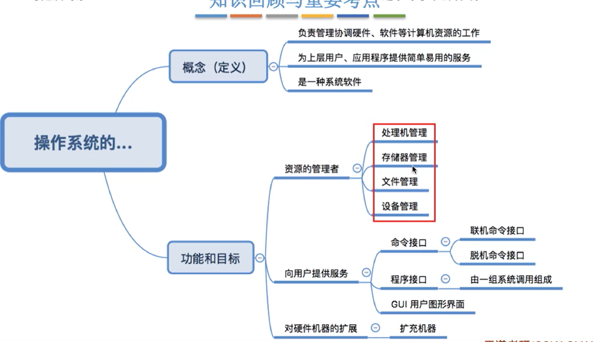
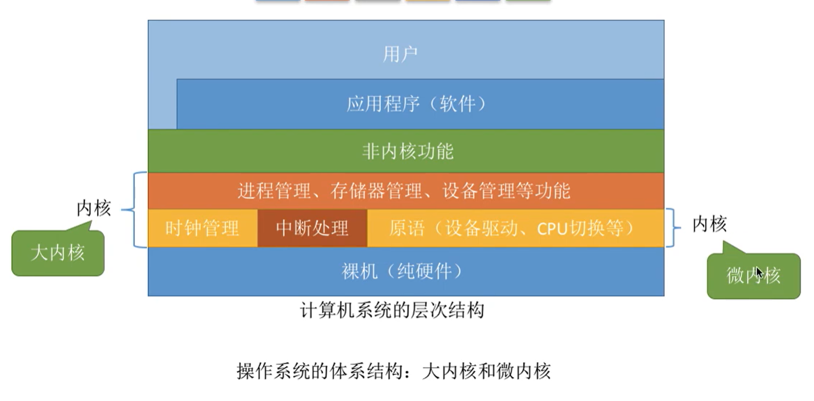
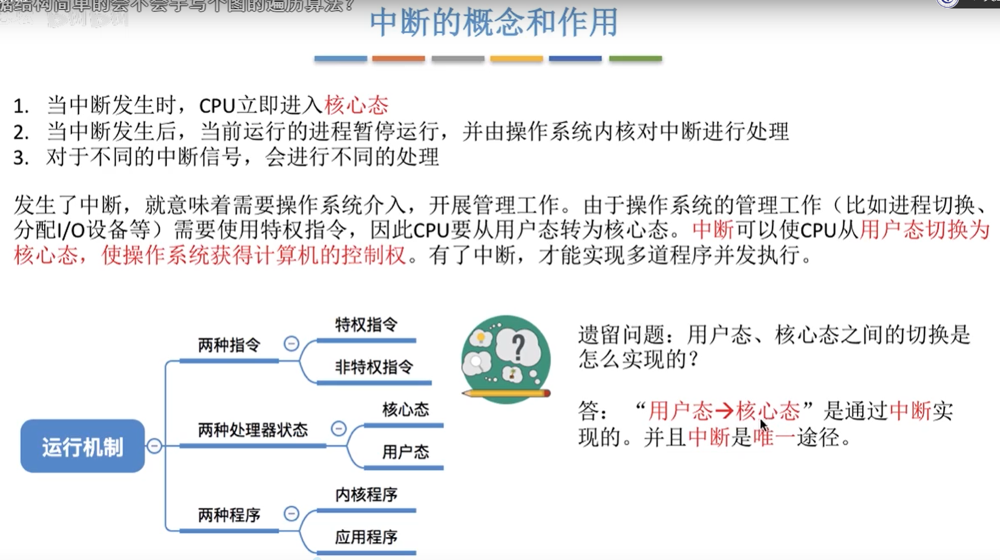
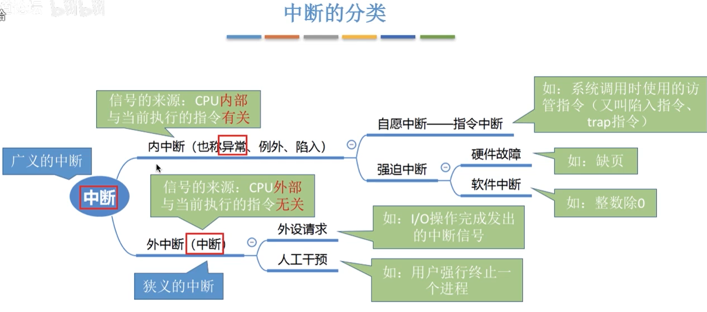

# 前言

## 操作系统是什么？

操作系统（Operating System，OS）是**控制和管理**整个计算机系统的硬件和软件资源，并**合理地组织调度**计算机的工作和资源的分配，以**提供**给用户其他软件方便的**接口和环境**，它是计算机系统中最基本的 **系统软件**

## 能干什么？

- #### 管理资源

  - 处理机管理
  - 存储器管理
  - 文件管理
  - 设备管理

- #### 向用户提供服务

  - 命令接口（**允许用户直接使用**）
    - 脱机命令接口：批处理；输入一堆指令，系统依序执行
    - 联机命令接口（**交互式命令接口**）：输入一条指令，系统执行一句指令
  - 程序接口（**允许用户通过程序间接使用**）
    - 由一组系统调用组成（程序接口 = 系统调用 = 系统调用命令 = **广义指令**）
  - GUI用户图形界面（了解）

- 对硬件机器的扩展

  - 扩充机器

## 有什么特点？

- 并发性（**并发和共享互为存在条件**）：指两个或多个事件在同一时间间隔内发生。这些事件 **宏观上是同时发生的**，但 **微观上是交替发生的**。操作系统的并发性指计算机系统中同时存在着多个运行着的程序
- 共享性（**并发和共享互为存在条件**）：共享性是指系统中的资源可以供多个并发的进程共同使用
  - 互斥共享方式：同一时间只允许一个进程访问，如打印机、摄像头等
  - 同时共享方式：同一时间允许多个进程访问，如硬盘
- 虚拟性：虚拟技术把一个物理实体转换为多个逻辑实体
  - 时分复用技术（如虚拟处理器技术）：例如多个进程能在同一个处理器上并发执行使用了时分复用技术，让每个进程轮流占有处理器，每次只执行一小个时间片并快速切换，这样就好像有多个处理器进行处理
  - 空分复用技术（如虚拟存储技术）
- 异步性：异步是指进程不是一次性执行完毕，而是走走停停，以不可知的速度向前推进

## 运行机制和体系结构

- 运行机制

  - 两种指令

    - 特权指令（**不允许用户程序使用**）：如内存管理指令
    - 非特权指令：如基本的运算指令

  - 两种处理器状态

    用**程序状态寄存器（PSW）**中的某标志位来标识当前处理器处于什么状态

    - 核心态（管态）：可以执行特权、非特权指令
    - 用户态（目态）：只能执行非特权指令

  - 两种程序

    - 内核程序：操作系统的内核程序是系统的管理者，既可以执行特权指令，也可以执行非特权指令，**运行在核心态**
    - 应用程序：为了能保证系统能安全运行，普通应用程序只能执行非特权指令，**运行在用户态**

- 操作系统内核

  - 时钟管理：实现计时功能
  - **中断管理（重点）**：负责实现**中断机制**
  - 原语
    - 是一种特殊的程序
    - 处于操作系统最底层，是**最接近硬件的部分**
    - 这种程序的运行具有**原子性**——**运行过程不能被中断**
    - 运行时间较短、调用频繁
  - 对系统资源进行管理的功能
    - 进程管理
    - 存储器管理
    - 设备管理

- 操作系统的体系结构

  

  - 大内核：将操作系统的主要功能模块都作为系统内核，运行在核心态
    - 优：高性能
    - 缺：内核代码庞大，结构混乱，难以维护
  - 微内核：只把最基本的功能保留在内核
    - 优：内核功能少，结构清晰，方便维护
    - 缺：需要频繁地在核心态和用户态之间切换，性能低

## 发展历史（了解）

- 手工操作阶段：人机速度矛盾
- 批处理阶段
  - 单道批处理系统（引入脱机输入输出技术）
    - 优：缓解人机速度矛盾
    - 缺：资源利用率低
  - 多道批处理系统（操作系统雏形）
    - 优：多道程序并发执行，资源利用率高
    - 缺：不提供人机交互功能
- 分时操作系统（时间片）
  - 优：提供人机交互功能
  - 缺：不能优先处理紧急事务
- 实时操作系统：能优先处理紧急任务
  - 硬实时系统：必须在绝对严格的规定时间内完成处理
  - 软实时系统：能接受偶尔违反时间规定
- 网络操作系统（了解）
- 分布式操作系统（了解）
- 个人计算机操作系统（了解）

# 中断

## 为什么引入中断？

为了实现多道程序并发执行。多道程序并发执行时，有可能可能出现互斥共享资源被其他进程占用的情况，或者时间片使用完的之前，此时就应该中断当前的进程，让CPU去处理其他进程

## 概念和作用

## 中断的分类

- 内中断（也称异常、例外、陷入）
  - 自愿中断——指令中断
  - 强迫中断
    - 软件故障
    - 软件中断（如程序发生异常）
- 外中断（中断）
  - 外设请求
  - 人工干预

**区分内中断和外中断的方法：判断是否由操作系统发起的**

## 中断处理过程

1. 执行完每个指令之后，CPU都要**检查**当前是否有外部中断信号
2. 如果检测到外部中断信号，则需要**保护**被中断进程的**CPU环境**（如程序状态字PSW、程序计数器PC、各种通用寄存器）
3. 根据中断信号类型转入相应的**中断处理**程序
4. **恢复**原进程的CPU环境并退出中断、返回原进程继续往下执行

# 系统调用（程序接口）

## 系统调用定义

应用程序通过系统调用**请求操作系统的服务**。系统中的各种共享资源都由操作系统统一管理，因此在用户程序中，凡是**和资源有关的操作**（如存储分配、I/O操作等），都必须通过系统调用的方式向操作系统**提出服务请求**，**由操作系统代为完成**。这样可以保证系统的**稳定性**和**安全性**，防止用户进行非法操作。

按功能来分类的话

- 设备管理：完成**设备**的请求、释放、启动等功能
- 文件管理：完成**文件**的读、写、创建、删除等功能
- 进程控制：完成**进程**的创建、撤销、阻塞、唤醒等功能
- 进程通信：完成进程之间，消息传递、信号传递等功能
- 内存管理：完成**内存**的分配、回收等功能

**系统调用相关处理**涉及对系统资源的管理、对进程的控制，这些功能需要执行一些**特权指令**才能完成，因此**系统调用的处理**需要在**核心态**下进行

## 系统调用流程

1. 传递系统调用参数
2. （用户态）用户程序执行陷入指令
3. （核心态）执行系统调用相应的服务程序
4. 返回用户程序

注意

- **陷入指令**是在**用户态**下执行的，执行陷入指令之后立即引发一个**内中断**，从而CPU进入**核心态**
- **发出系统调用**的请求是在**用户态**，而对**系统调用相应处理**在**核心态**下进行
- 陷入指令是**唯一一个**只能**在用户态执行**，而**不能在核心态执行的指令**

# 进程

## 进程的定义

## 进程的组织方式

在一个系统中，通常有数十、数百乃至数千个PCB。为了能对他们加以有效的管理，应该用适当的方式把这些PCB组织起来。

进程的组织方式主要分类两类：

- 链接方式：按照**进程状态**将PCB分为多个**队列（就绪队列、运行队列等）**，操作系统持有指向各个队列的指针

- 索引方式：根据**进程状态**不同将PCB分为多张**索引表**，操作系统持有指向各个索引表的指针

## 进程的特征

- 动态性（**最基本的特征**）：进程是程序的一次执行过程，是动态地产生、变化和消亡的
- 并发性：内存中有多个进程实体，各进程可并发执行
- 独立性：进程是能独立运行、独立获得资源、独立接受调度的基本单位（**进程是资源分配，接受调度的基本单位**）

- 异步性：各进程按各自独立的、不可预知的速度向前推进，总是**走走停停**地执行
- 结构性：每个进程都会配置一个PCB。**结构上看**，进程由程序段、数据段、PCB组成

## 进程状态

- 运行状态（**基本状态**）：占有CPU，并在CPU上运行
- 就绪状态（**基本状态**）：已具备运行条件，但由于没有空闲CPU，而暂时不能运行。换句话说，**在等待CPU**
- 阻塞状态（**基本状态**）：因等待某一事件而暂时不能运行（比如需要请求打印机，而打印机已经被其他进程占用）
- 创建状态：进程**正在被创建**，操作系统为进程分配资源，初始化PCB
- 终止状态：进程**正在从系统中撤销**，操作系统会回收进程拥有的资源、撤销PCB

### 状态转换

## 补充：进程的七状态模型

## 进程控制（实现状态转换）

进程控制的主要功能是对系统中的所有进程实施有效的管理，它具有**创建新进程**、**撤销已有进程**、实现**进程状态转换**等功能

### 进程控制的实现

### 进程控制原语

## 进程通信

### 共享内存

### 管道通信

### 消息传递

## 进程同步、互斥

### 进程同步概念

### 进程互斥概念

## 进程互斥算法

### 软件实现方法

#### 单标志法

#### 双标志先检查法

#### 双标志后检查法

#### Peterson算法

### 硬件实现方法

#### 中断屏蔽方法

#### TestAndSet(TS指令或TSL指令)

#### Swap指令

# 信号量

## 信号量类型

### 整型信号量

### 记录型信号量

## 信号量机制

### 信号量实现进程同步

### 信号量实现进程互斥

### 信号量实现进前驱关系

# 线程

## （定义）为什么要引入线程？

1. ”**线程**”可以理解为“**轻量级进程**”
2. 线程是一个基本的**CPU执行单元**，也是**程序执行的最小单位**
3. 引入线程后，不仅是进程之间可以并发，进程内的各线程之间也可以并发，从而进一步提升了**系统的并发度**
4. 引入线程后，进程只作为**除CPU之外的系统资源的分配单元**

## 线程的属性

## 线程的实现方式

## 多线程模型

# 调度

## 基本概念

## 调度的三个层次

## 调度的细节

### 调度的时机

### 调度的方式

## 调度算法的评价指标

### 计算方式

## 调度算法

## 先来先服务（FCFS，First Come First Serve）

## 短作业优先（SJF，Shortest Job First）

## 高响应比优先（HRRN，High Response Ratio First ）

## 时间片轮转（RR，Round Robin）

## 优先级调度算法

## 多级反馈队列调度算法

# 管程

## 为什么要引入管程？

## 管程的定义

## 管程拓展

# 死锁

## 死锁、饥饿、死循环的区别

## 产生死锁的必要条件

## 死锁的处理策略

### 破坏不剥夺条件

### 破坏请求和保持条件

### 破坏循环等待条件

## 安全序列

## 银行家算法

## 死锁的检测和解除

### 检测

### 解除

# 内存

## 内存的基本知识

### 定义

### 逻辑地址、物理地址

### 内存的装入

#### 装入的3种方式

### 程序模块在内存中的链接方式

### 拓展

## 内存管理

### 地址转换

### 内存保护

### 内存的分配和回收

#### 单一连续分配

#### 固定分区分配

#### 动态分区分配

##### 动态分区分配算法

## 覆盖和交换

### 覆盖

### 交换

## 分页存储技术

